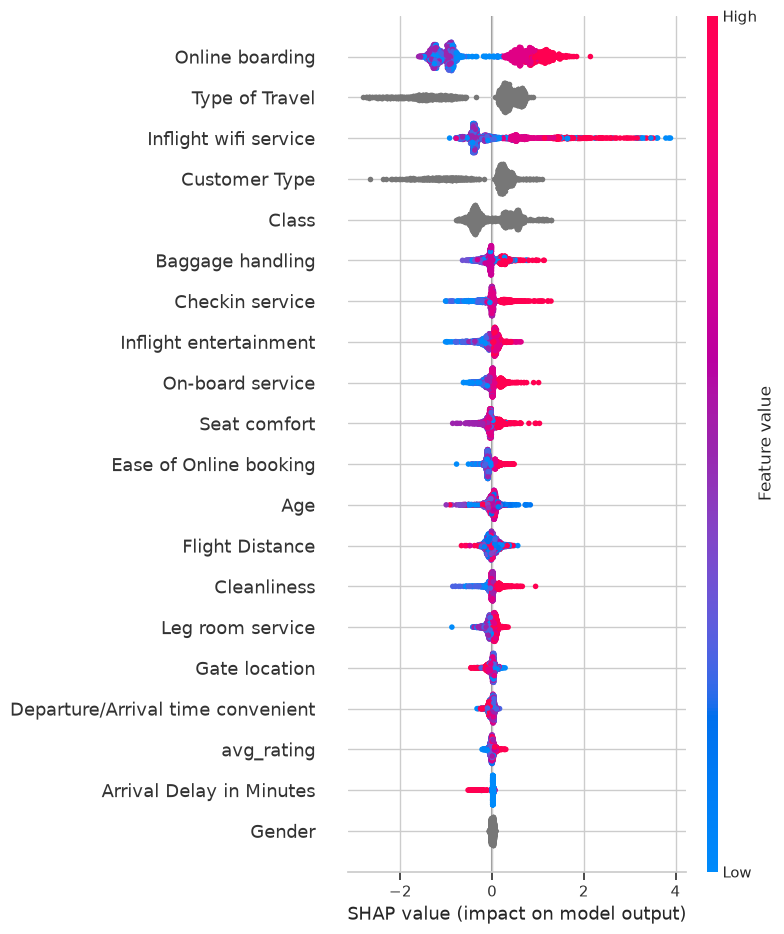
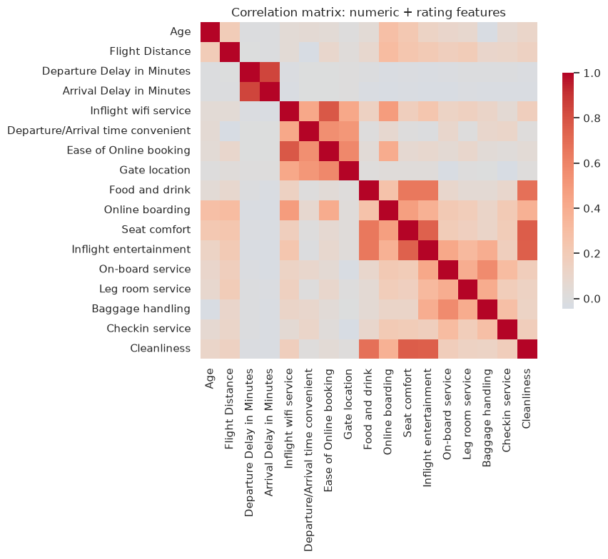
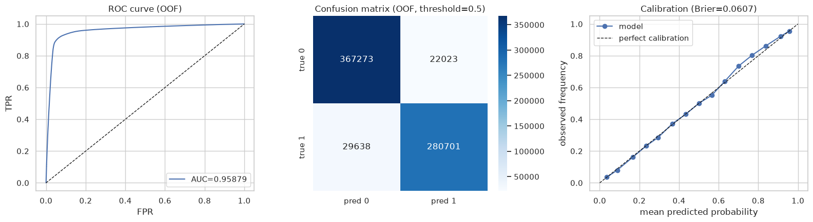
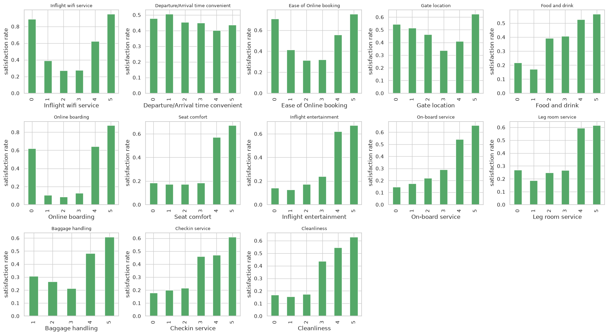
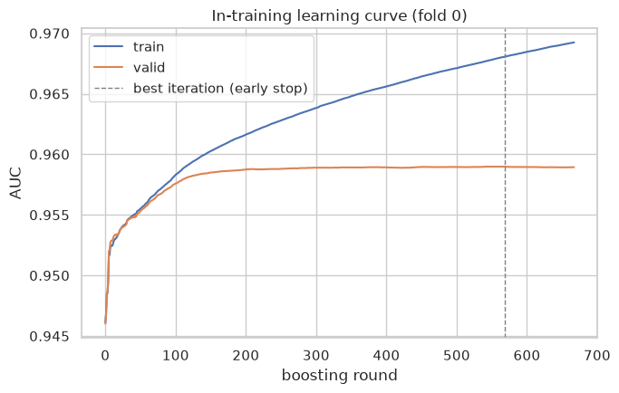
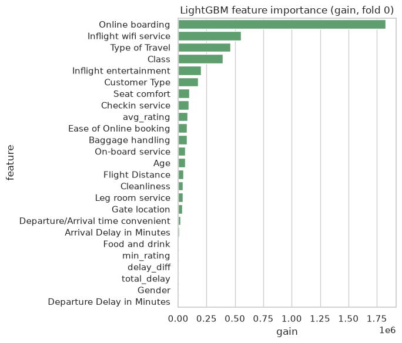
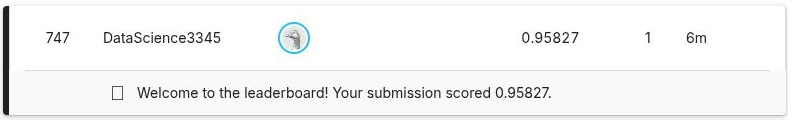

# Predicting Airline Satisfaction — Playground Series S6E10

Binary classification on ~1M rows of airline survey + flight data: predict whether a passenger
reports being satisfied. Metric: **ROC AUC**.

- **Kaggle competition:** https://www.kaggle.com/competitions/playground-series-s6e10
- **Kaggle notebook (executed, public):** https://www.kaggle.com/code/datascience3345/predicting-airline-satisfaction-lightgbm-shap
- **Final 5-fold CV ROC AUC:** 0.95880 ± 0.00058
- **Public leaderboard score:** 0.95827 (rank 747 / 1099 at submission time)

## Pipeline

1. **Data understanding** — target balance, missingness, numeric/rating/categorical distributions,
   correlation structure.
2. **Feature engineering** — delay gap/total, mean/min of the fourteen 1–5 service ratings.
3. **Modeling** — LightGBM, 5-fold stratified CV, early stopping, in-training learning curves to
   confirm no overfitting runaway, per-fold stability check. The 5 folds are trained as 5
   independent OS processes in parallel (not relying on LightGBM's own in-process threading —
   see [`bench_threads.py`](bench_threads.py) and [`results/PROVENANCE.md`](results/PROVENANCE.md)
   for why).
4. **Post-training diagnostics** — gain-based feature importance, SHAP, ROC curve, confusion
   matrix, calibration curve, error-segment breakdown.
5. **Submission** — scored on the public leaderboard; CV estimate and leaderboard score agree
   closely.

Full notebook: [`01_airline_satisfaction.ipynb`](01_airline_satisfaction.ipynb).

## Visualizations

<table>
<tr>
<td width="50%">

**SHAP summary — what actually drives the prediction**



</td>
<td width="50%">

**Feature correlation structure**



</td>
</tr>
<tr>
<td width="50%">

**ROC curve, confusion matrix, calibration (out-of-fold)**



</td>
<td width="50%">

**Satisfaction rate by service rating (1–5) — all 14 ratings**



</td>
</tr>
<tr>
<td width="50%">

**In-training learning curve (fold 0) — overfitting check**



</td>
<td width="50%">

**LightGBM feature importance (gain)**



</td>
</tr>
</table>

## Leaderboard



## Mathematical foundations

**Metric.** ROC AUC is the probability that a randomly chosen positive example is ranked above a
randomly chosen negative one:

$$\mathrm{AUC} = P(\hat p_{+} > \hat p_{-}) = \int_0^1 \mathrm{TPR}(\mathrm{FPR}^{-1}(t))\,dt$$

equivalently the (normalized) Mann–Whitney U statistic over the model's scores. It is threshold-free
and invariant to monotonic rescaling of the predicted probability, which is why a well-ranked but
poorly calibrated model can still score well — Gini coefficient $= 2\,\mathrm{AUC} - 1$ relates it to
the more familiar Lorenz-curve measure.

**Gradient boosting.** LightGBM fits an additive ensemble

$$F_M(x) = \sum_{m=1}^{M} \eta\, h_m(x)$$

where each $h_m$ is a regression tree fit, not to the raw labels, but to the functional gradient of
the loss at the current prediction. For binary log loss

$$L(y, p) = -\big(y \log p + (1-y)\log(1-p)\big), \qquad p = \sigma(F)$$

the per-sample gradient and Hessian (first and second derivatives of $L$ w.r.t. $F$) are

$$g_i = p_i - y_i, \qquad h_i = p_i(1-p_i)$$

Each new tree is fit by a second-order (Newton) approximation of the loss, giving a closed-form
optimal leaf weight

$$w_j^{*} = -\frac{\sum_{i \in j} g_i}{\sum_{i \in j} h_i + \lambda}$$

and a closed-form split gain used to choose every split:

$$\mathrm{Gain} = \tfrac{1}{2}\left[\frac{G_L^2}{H_L+\lambda} + \frac{G_R^2}{H_R+\lambda} - \frac{G^2}{H+\lambda}\right] - \gamma$$

where $G, H$ are the summed gradient/Hessian over a node and $\lambda, \gamma$ are the L2 and
complexity penalties used in this notebook's `params`.

**Why LightGBM specifically.** Two choices make it fast at this row count: (1) **histogram-based
splitting** — continuous features are pre-binned into ≤255 buckets, turning an $O(n)$ sort-based
split search into an $O(\text{bins})$ scan per feature per node; (2) **leaf-wise (best-first) growth**
— at each step it grows the single leaf with the largest `Gain` rather than expanding every leaf at
the current depth, reaching a given loss reduction in fewer splits than level-wise growth (at the
cost of deeper, more overfit-prone trees — which is exactly why early stopping on a held-out fold,
not just a fixed tree count, matters here).

**Early stopping** is a variance-reduction device, not a correctness one: boosting rounds are added
until validation AUC stops improving for 100 rounds, which is what the learning-curve plot above is
actually verifying — that the train/valid gap stays small and the stopping point is well inside the
2000-round budget rather than at its edge.

**SHAP.** Feature attributions $\phi_i$ satisfy the efficiency property
$\sum_i \phi_i = f(x) - \mathbb{E}[f(x)]$ — the Shapley values from cooperative game theory applied to
features-as-players. A brute-force computation is $O(2^{|\text{features}|})$; TreeSHAP (used here via
`shap.TreeExplainer`) computes the exact same values in polynomial time by exploiting the tree
structure, which is why it's tractable on a 22-feature model.

**Calibration.** The Brier score $\frac{1}{n}\sum_i (\hat p_i - y_i)^2$ measures whether predicted
probabilities are *quantitatively* trustworthy, not just well-ranked — a model can have excellent
AUC while being badly calibrated. The calibration-curve panel above checks this directly.

## Repository layout

```
01-predicting-airline-satisfaction/
├── 01_airline_satisfaction.ipynb   # full executed notebook (local run)
├── bench_threads.py                 # LightGBM thread-scaling benchmark (see Modeling, step 3)
├── kaggle_kernel/                   # Kaggle-notebook-ready copy (path-agnostic data loading)
├── submission.csv                   # scored submission (public LB 0.95827)
├── assets/                          # exported plots + leaderboard screenshot
└── results/PROVENANCE.md            # compute provenance for the offloaded training run
```
