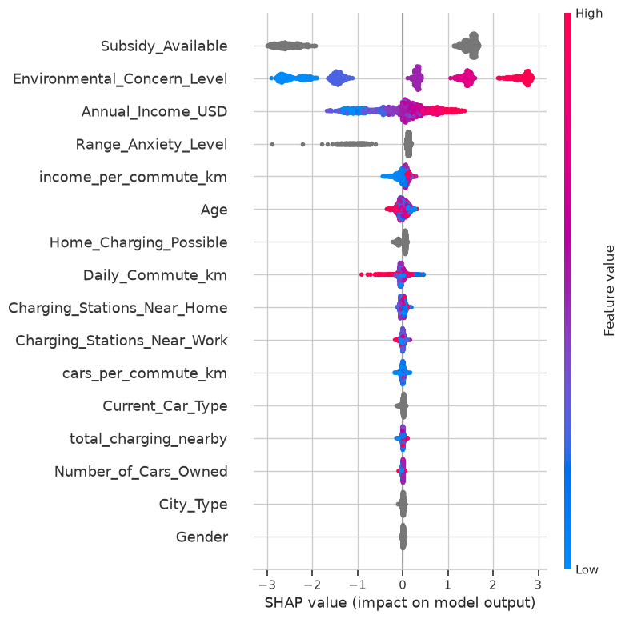
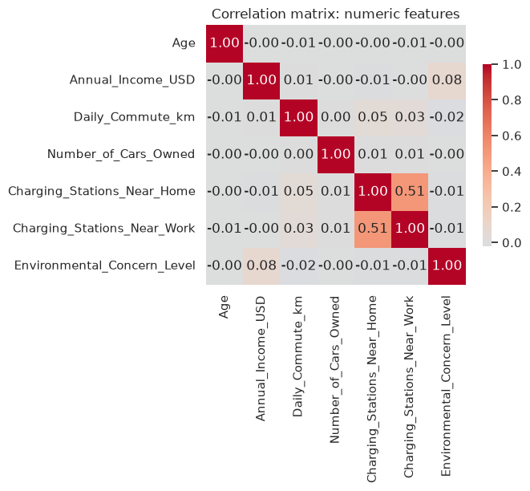
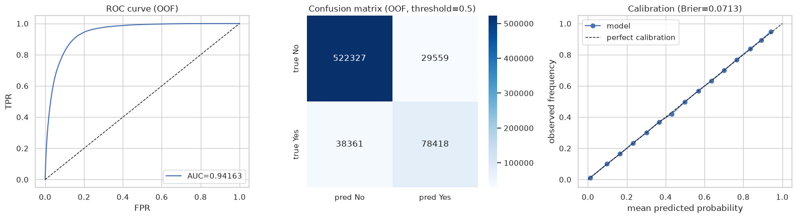
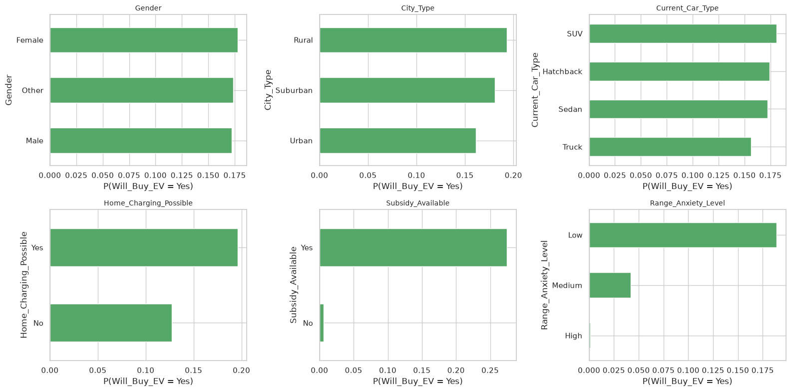
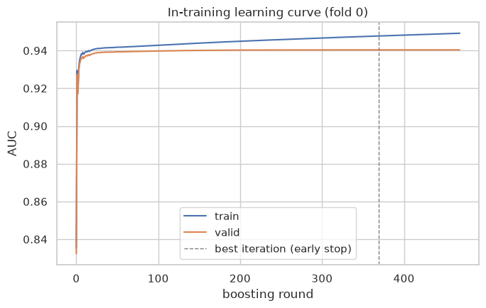
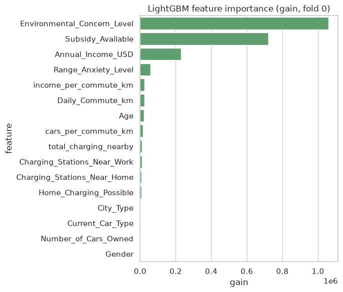
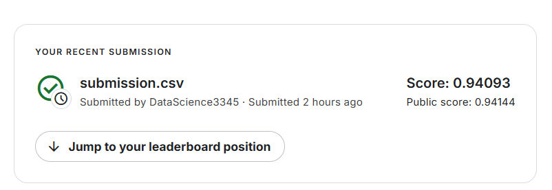

# Predicting Electric Vehicle Purchases — Playground Series S6E9

Binary classification on ~670k rows of demographic, commute, and EV-infrastructure features:
predict `Will_Buy_EV`. Metric: **ROC AUC**.

- **Kaggle competition:** https://www.kaggle.com/competitions/playground-series-s6e9 (closed —
  scored as a late submission)
- **Kaggle notebook (executed, public):** https://www.kaggle.com/code/datascience3345/predicting-electric-vehicle-purchases-lgbm-shap
- **Final 5-fold CV ROC AUC:** 0.94164 ± 0.00080
- **Leaderboard score:** public 0.94144, private 0.94093

## Pipeline

Same validated structure as [`01-predicting-airline-satisfaction`](../01-predicting-airline-satisfaction/):
data understanding → feature engineering → LightGBM 5-fold CV (folds parallelized as separate
processes, in-training learning curves) → post-training diagnostics (SHAP, calibration, error
analysis) → final metric → submission.

One notable difference: the target here is imbalanced (~82.5% No / 17.5% Yes), so the notebook
calls out explicitly why ROC AUC stays the right metric despite that (threshold-free, not fooled
by the majority class) and why a 0.5-threshold confusion matrix under-predicts the minority class
as an expected consequence of that imbalance, not a bug.

Full notebook: [`02_ev_purchases.ipynb`](02_ev_purchases.ipynb).

## Visualizations

<table>
<tr>
<td width="50%">

**SHAP summary — what drives the prediction**



</td>
<td width="50%">

**Feature correlation structure**



</td>
</tr>
<tr>
<td width="50%">

**ROC curve, confusion matrix, calibration (out-of-fold)**



</td>
<td width="50%">

**Purchase rate by categorical feature**



</td>
</tr>
<tr>
<td width="50%">

**In-training learning curve (fold 0)**



</td>
<td width="50%">

**LightGBM feature importance (gain)**



</td>
</tr>
</table>

**Submission score:**



## Reproducing

```bash
pip install kaggle pandas numpy scikit-learn lightgbm matplotlib seaborn shap joblib jupyter nbconvert
kaggle competitions download -c playground-series-s6e9 -p data
cd data && unzip playground-series-s6e9.zip && cd ..

jupyter nbconvert --to notebook --execute --inplace 02_ev_purchases.ipynb
```

## Repository layout

```
02-predicting-ev-purchases/
├── 02_ev_purchases.ipynb   # full executed notebook
├── kaggle_kernel_source.ipynb  # Kaggle-notebook-ready copy (path-agnostic data loading)
├── submission.csv           # scored submission (public LB 0.94144)
├── assets/                  # exported plots
└── results/PROVENANCE.md    # compute provenance for the training run
```
