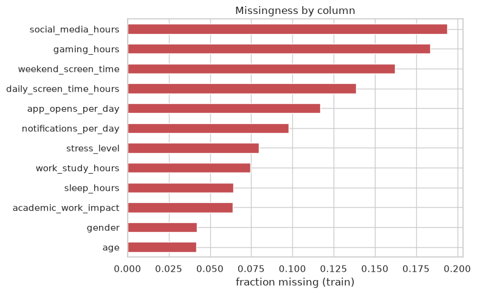

# Predicting Smartphone Addiction — Playground Series S6E8

Binary classification on ~690k rows of screen-time, lifestyle, and demographic features:
predict `addicted_label`. Metric: **ROC AUC**.

- **Kaggle competition:** https://www.kaggle.com/competitions/playground-series-s6e8 (closed —
  scored as a late submission)
- **Final 5-fold CV ROC AUC:** 0.96364 ± 0.00056
- **Leaderboard score:** 0.96506, public 0.96524

## Pipeline

Same validated structure as the rest of this series: data understanding → feature engineering →
LightGBM 5-fold CV (folds parallelized as separate processes, in-training learning curves) →
post-training diagnostics (SHAP, calibration, error analysis) → final metric → submission.

What's different here: almost every column has real missingness (up to ~19% of rows), unlike the
first two competitions in this series. The notebook checks that train/test missingness fractions
match (no distribution shift risk from imputation), adds explicit missing-value indicator
features for the five most-incomplete columns, and checks post-training whether those
indicators carried real predictive signal (missing-not-at-random) or were just noise.

Full notebook: [`03_smartphone_addiction.ipynb`](03_smartphone_addiction.ipynb).

## Visualizations

<table>
<tr>
<td width="50%">

**Missingness by column**



</td>
<td width="50%">

**SHAP summary — what drives the prediction**


</td>
</tr>
<tr>
<td width="50%">

**Feature correlation structure**


</td>
<td width="50%">

**LightGBM feature importance (gain)**


</td>
</tr>
<tr>
<td width="50%">

**In-training learning curve (fold 0)**


</td>
<td width="50%">

**ROC curve, confusion matrix, calibration (out-of-fold)**


</td>
</tr>
</table>

**Submission score:**


## Reproducing

```bash
pip install kaggle pandas numpy scikit-learn lightgbm matplotlib seaborn shap joblib jupyter nbconvert
kaggle competitions download -c playground-series-s6e8 -p data
cd data && unzip playground-series-s6e8.zip && cd ..

jupyter nbconvert --to notebook --execute --inplace 03_smartphone_addiction.ipynb
```

## Repository layout

```
03-predicting-smartphone-addiction/
├── 03_smartphone_addiction.ipynb   # full executed notebook
├── submission.csv                   # scored submission (public LB 0.96506)
├── assets/                          # exported plots
└── results/PROVENANCE.md            # compute provenance for the training run
```
