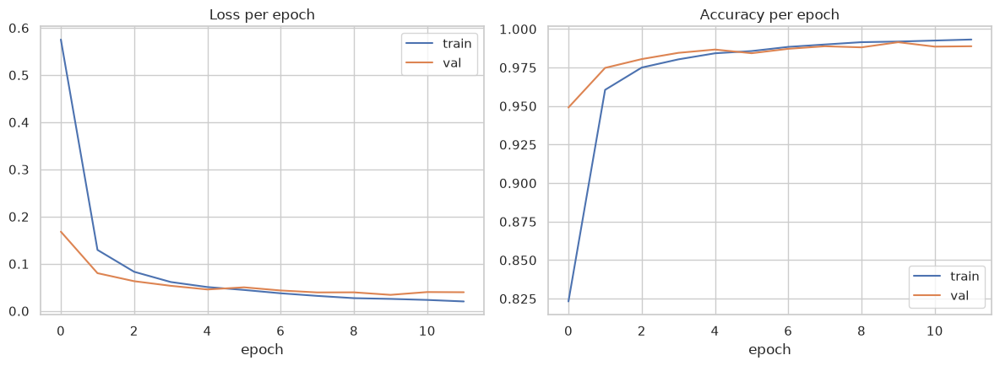
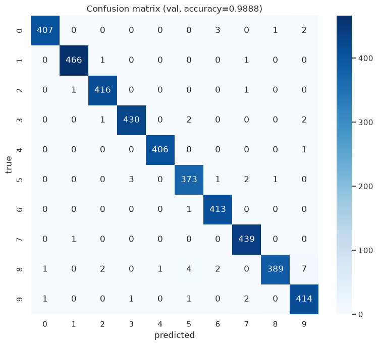
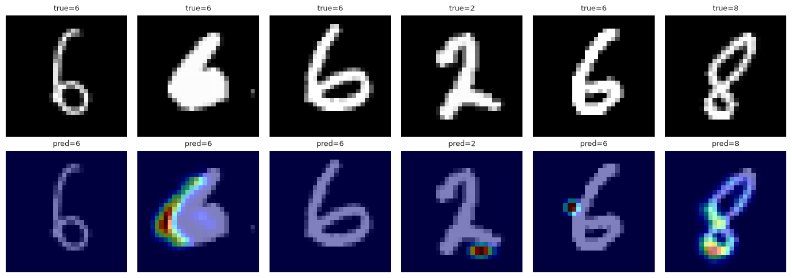
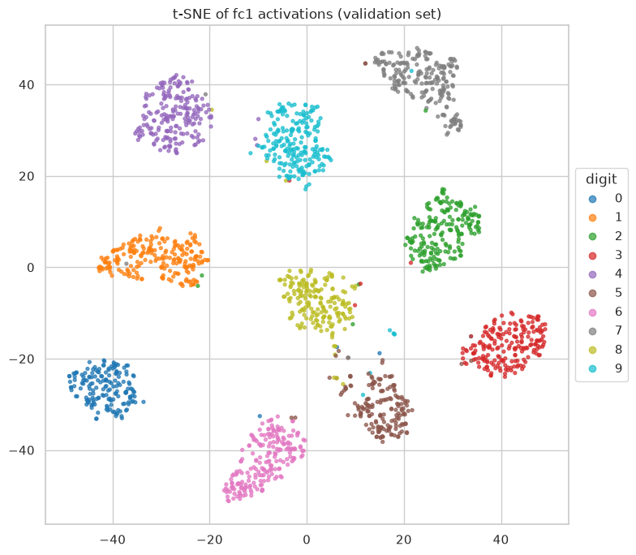
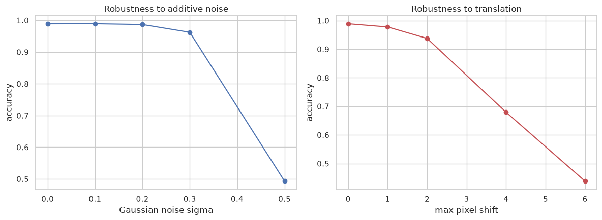
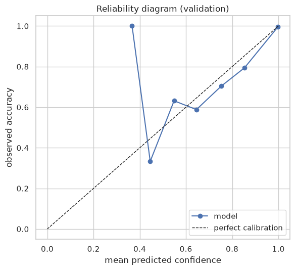

# Digit Recognizer — MNIST

The first computer-vision entry in this series. Multiclass image classification: predict the
digit (0-9) in each 28x28 grayscale image. Metric: **categorization accuracy**.

- **Kaggle competition:** https://www.kaggle.com/competitions/digit-recognizer
- **Validation accuracy:** 0.98881
- **Leaderboard score:** 0.98860 (public)

## Why this one is different from #1-3

Competitions #1-3 were all tabular binary classification scored by ROC AUC, solved with the same
LightGBM 5-fold CV pipeline — only the columns changed. This one swaps the entire approach: a
small CNN trained with backprop on raw pixels instead of gradient-boosted trees on engineered
features, and a different diagnostic toolkit to match (Grad-CAM and embedding visualization
instead of SHAP, a reliability diagram instead of a tabular calibration curve, a synthetic
robustness stress test instead of a feature-missingness check).

## Pipeline

1. Data understanding — class balance, sample images per digit, pixel intensity distribution
2. Preprocessing — normalize to [0,1], reshape to image tensors, stratified train/val split
3. Modeling — a small CNN (2 conv blocks + 2 FC layers), trained with per-epoch loss/accuracy
   monitoring
4. Post-training diagnostics — confusion matrix, per-class accuracy, misclassified-image gallery
5. Extended analysis:
   - **Non-deep baseline** (PCA + logistic regression) to justify the CNN's complexity against
   - **Grad-CAM** — visualizes which pixels actually drove each prediction
   - **t-SNE embedding** of the learned representation, colored by true digit
   - **Robustness stress test** — accuracy under synthetic noise and pixel-shift corruption
   - **Reliability diagram** — is the model's own confidence trustworthy, not just its accuracy
   - **Hardest-examples-by-entropy** — the most uncertain predictions, right or wrong, not just
     the wrong ones
6. Final validation accuracy
7. Full-data fit + submission

Full notebook: [`04_digit_recognizer.ipynb`](04_digit_recognizer.ipynb).

## Visualizations

<table>
<tr>
<td width="33%">

**Loss/accuracy per epoch**



</td>
<td width="33%">

**Confusion matrix (validation)**



</td>
<td width="33%">

**Grad-CAM — what the CNN looks at**



</td>
</tr>
<tr>
<td width="33%">

**t-SNE of the learned representation**



</td>
<td width="33%">

**Robustness to noise and pixel shift**



</td>
<td width="33%">

**Reliability diagram**



</td>
</tr>
</table>

## Reproducing

```bash
pip install kaggle pandas numpy scikit-learn torch matplotlib seaborn jupyter nbconvert
kaggle competitions download -c digit-recognizer -p data
cd data && unzip digit-recognizer.zip && cd ..

jupyter nbconvert --to notebook --execute --inplace 04_digit_recognizer.ipynb
```

## Repository layout

```
04-digit-recognizer/
├── 04_digit_recognizer.ipynb   # full executed notebook
├── submission.csv               # scored submission (public LB 0.98860)
├── assets/                      # exported plots
└── results/PROVENANCE.md        # compute provenance for the training run
```
