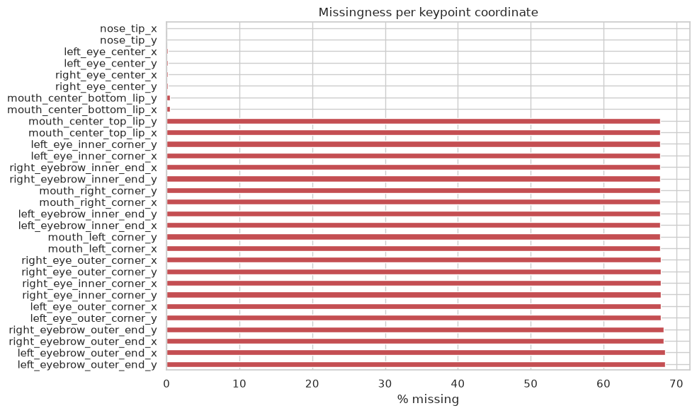
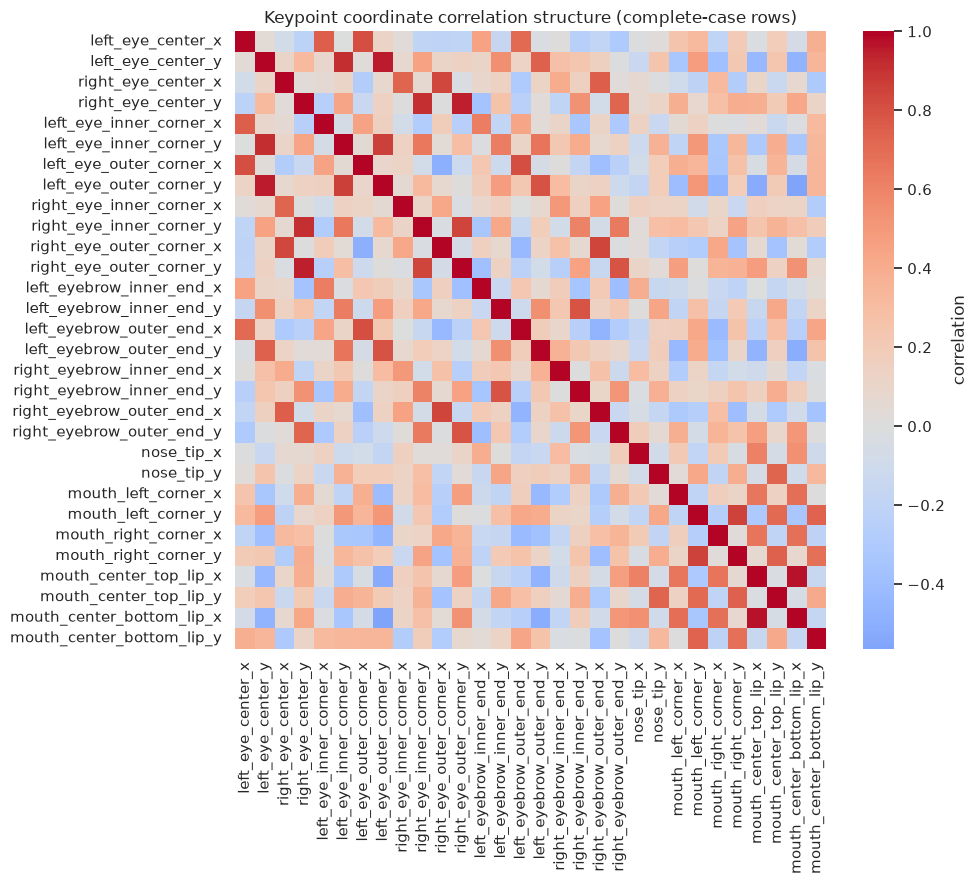
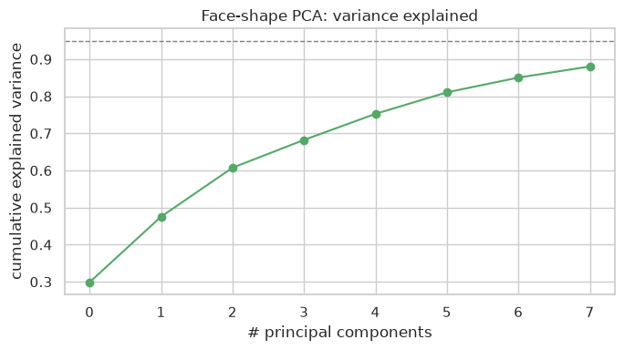
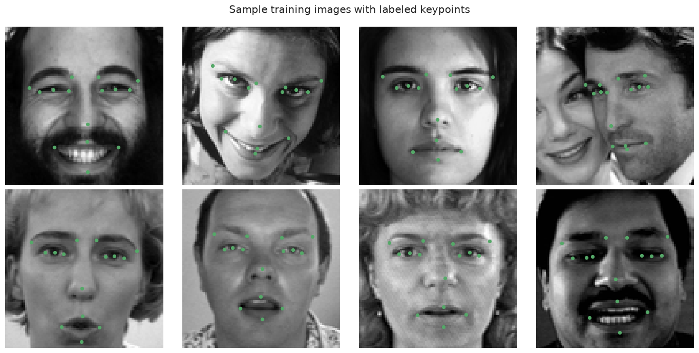
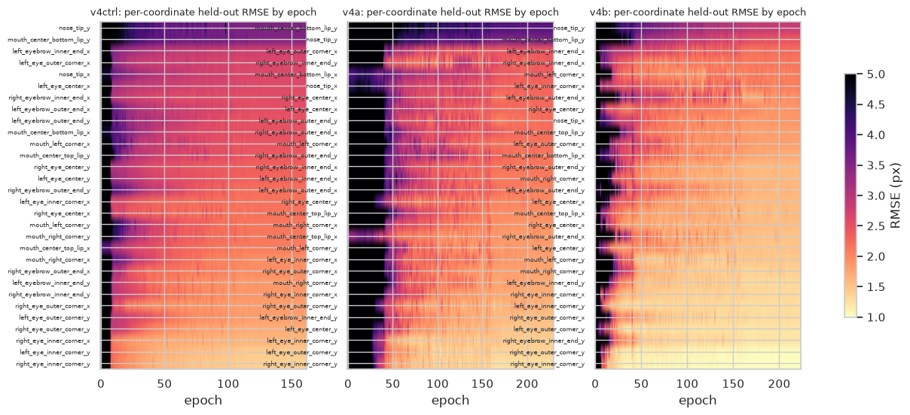
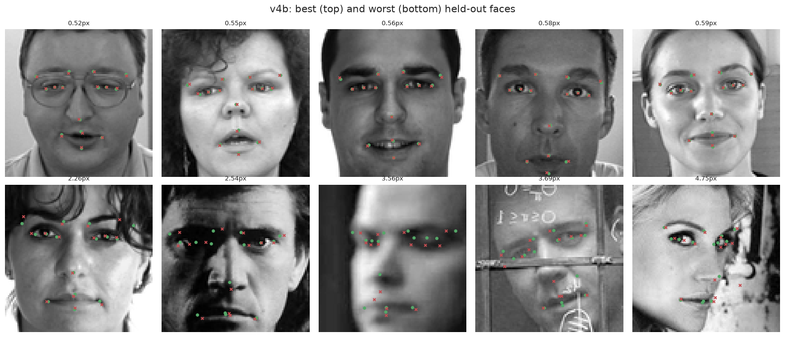
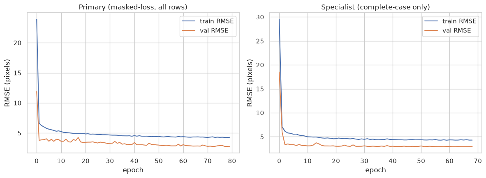
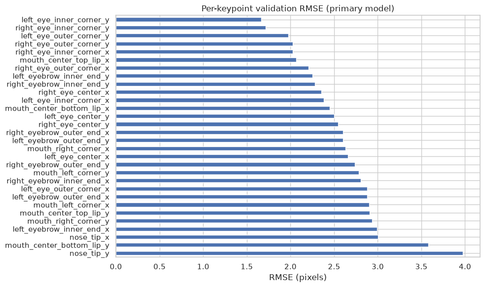
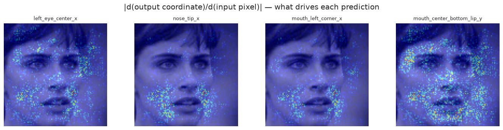
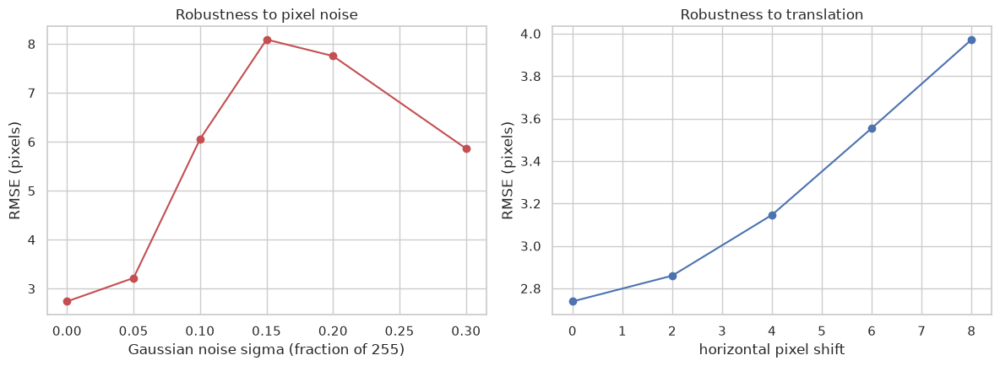

# Facial Keypoints Detection

Kaggle: https://www.kaggle.com/competitions/facial-keypoints-detection — predict 15 facial landmarks (30 x/y
coordinates) on 96×96 grayscale faces; scored by RMSE in pixels.

**Best result: 1.61419 private / 1.94381 public RMSE** (v4b: integral regression with Adaptive Wing Loss), down from
2.75978 private for the first model. On a held-out 12% of the training set it scores 1.7407px.


## Every attempt, in order

All models after v1 are scored on the same held-out 12% (`train_test_split(test_size=0.12, random_state=42)`),
so their validation numbers are directly comparable. "Seed band" = the change from retraining v2's exact
configuration with a different seed: **0.022px**. Differences smaller than that are noise.

| # | Model | What changed | Held-out RMSE | Kaggle private / public | Outcome |
|---|---|---|---|---|---|
| v1 | Direct regression CNN | Masked MSE on all 7,049 rows (labels missing in 68% of rows), global-pool + FC head | 2.7384 | 2.75978 / 2.95000 | Baseline |
| v2a | Integral regression, short budget | Heatmap head + soft-argmax; heatmap warm-up then L1 on coordinates; 8 + 20 epochs | 3.0561 | — | Under-trained: still improving when stopped |
| v2b | v2a resumed from its checkpoint | Same model, trained to epoch 159 (early stop) | **2.4385** | 2.46539 / 2.65896 | Beats v1 by 11% |
| v3 | v2b's recipe on 100% of rows | Retrained from scratch on all labelled data, L4 GPU, mixed precision | 2.3826 *(leaky)* | 2.62105 / 2.86097 | **Worse than v2b on Kaggle**; its monitor rows were in its training set, so its validation number was optimistic |
| v4a | v2 architecture + new recipe | Affine / photometric / occlusion augmentation, σ=2 targets, learnable softmax temperature, joint heatmap + L1 loss, flip test | 2.3055 (2.1980 flip) | 2.24540 / 2.37053 | −0.13px vs v2b, 6× the seed band |
| **v4b** | **Adaptive Wing Loss** | v4a recipe + Adaptive Wing Loss with Weighted Loss Map, 48×48 heatmap, CoordConv | **1.7986 (1.7407 flip)** | **1.61419 / 1.94381** | **−0.70px vs v2b; best** |
| ctrl | v2b configuration, seed 7 | Nothing but the seed | 2.4601 | not submitted | Defines the seed band |
| v4c | Residual backbone + 2-stage head | Planned capacity test | — | — | Not run: 62 s/epoch at full resolution would not finish in the compute window → [future work](#future-work) |

## What the data says first

- **Missingness is structured, not random.** Only 4 keypoints are labelled in almost every row; the other 11 are
  missing in ~68% of rows. Complete-case images differ in brightness and contrast from incomplete ones (Welch
  t-test, p < 0.01), so dropping incomplete rows would bias the training set. Every model therefore trains on
  all rows with a **masked loss** that ignores missing coordinates.
- **The face shape is low-dimensional.** Mirror-image keypoints correlate strongly, and a PCA shape model needs only
  a handful of modes for most of the variance — evidence that landmarks should be predicted with spatial structure,
  not as 30 independent numbers.

<table>
<tr><td width="50%"><b>Missingness per coordinate</b><br></td>
<td width="50%"><b>Complete vs incomplete rows differ (MNAR evidence)</b><br></td></tr>
<tr><td width="50%"><b>Keypoint correlation structure</b><br></td>
<td width="50%"><b>PCA shape model: variance explained</b><br></td></tr>
<tr><td width="50%"><b>Mean shape and the top two modes of variation</b><br></td>
<td width="50%"><b>Labelled training samples</b><br></td></tr>
</table>

## The mechanism that mattered: centre-pull in soft-argmax

Integral regression turns a heatmap $`H_k`$ into coordinates with a differentiable expectation:

$$\hat{\mathbf{p}}_k = \sum_{\mathbf{u}} \mathbf{u}\,\mathrm{softmax}\big(\beta H_k\big)(\mathbf{u}).$$

v2 trained $`H_k`$ towards a Gaussian with values in $`[0,1]`$ and used $`\beta = 1`$. A softmax of values that
span only one unit is nearly flat, so every background cell keeps weight and the expectation is pulled toward the
centre of the grid. Measured on **ideal** Gaussian heatmaps (no network involved), the error of the decoder alone:

| Heatmap | σ (cells) | β | Mean error (px) |
|---|---|---|---|
| 24×24 | 1.0 | 1 (v2) | ≈ 14 |
| 24×24 | 1.0 | 15 (best for σ=1) | 0.551 |
| 24×24 | 2.0 | 12 | **0.031** |
| 48×48 | 2.0 | 15 | **0.022** |

Too small a β leaks mass to the background; too large a β collapses to argmax and re-introduces quantization.
Widening the target to σ = 2 cells lets one β satisfy both. The trained models confirm it: the slope of
prediction on truth (1 = unbiased) is **0.575 for v2** and 0.573 for its seed control, versus **0.79 for v4a/v4b**
with σ = 2 and a learnable β (which settled at 18.7 and 21.2). Raising v2's β after training only hurts
(β = 1.5: 4.75px), because its weights had compensated for the flat softmax.

## Adaptive Wing Loss (v4b)

MSE gives tiny gradients for the small errors that decide where a heatmap's peak sits. Adaptive Wing Loss
(Wang, Bo & Li, ICCV 2019) adapts its shape to the target value $`y`$ of each pixel:

$$\mathrm{AWing}(y,\hat y)=\begin{cases}\omega\ln\!\big(1+\lvert (y-\hat y)/\varepsilon\rvert^{\alpha-y}\big) & \lvert y-\hat y\rvert<\theta\\ A\lvert y-\hat y\rvert-C & \text{otherwise}\end{cases}$$

with $`A=\omega\,\frac{1}{1+(\theta/\varepsilon)^{\alpha-y}}\,(\alpha-y)\,(\theta/\varepsilon)^{\alpha-y-1}/\varepsilon`$ and
$`C=\theta A-\omega\ln(1+(\theta/\varepsilon)^{\alpha-y})`$, using $`\omega=14,\ \theta=0.5,\ \varepsilon=1,\ \alpha=2.1`$.
Near a peak ($`y\to1`$) it behaves like Wing loss (large influence on small errors); on background ($`y\to0`$) it
becomes MSE-like. A **Weighted Loss Map** multiplies the loss by $`W\cdot M+1`$ ($`W=10`$), where $`M`$ marks pixels whose
3×3 grey dilation of the target is ≥ 0.2 — foreground plus the hard background next to it. v4b also raises the
heatmap to 48×48 and adds CoordConv (two coordinate channels), as in the paper.

## In-training statistics

No figure is drawn while training. Every epoch appends the statistics below to `results/<run>_history.json`;
the figures are drawn afterwards. Dots on the RMSE panel are flip-test evaluations (every 10 epochs).

<table>
<tr><td colspan="2"><b>Held-out RMSE, loss split, learning rate, temperature β, gradient norm, centre-pull slope, softmax entropy and peak probability</b><br></td></tr>
<tr><td colspan="2"><b>Per-coordinate held-out RMSE by epoch</b> (rows sorted by final error)<br></td></tr>
</table>

- Stage A (heatmap only) ran to its 40-epoch cap for v4a/v4b; the jump at epoch 40 is the switch to the joint loss.
- β grows during training (12 → 18.7, 15 → 21.2): the network sharpens its own softmax once coordinates are supervised.
- The heatmap-loss weight in Stage B is fixed at the first batch so the heatmap term starts at 20% of the L1 term
  (1.58 for Adaptive Wing, 123.6 for MSE — their raw scales differ by two orders of magnitude).

## Post-training diagnostics

<table>
<tr><td width="50%"><b>Best held-out RMSE per model</b> (orange: v2 seed band)<br></td>
<td width="50%"><b>Decoders on v4b's heatmaps</b><br></td></tr>
<tr><td width="50%"><b>Per-keypoint RMSE, all models</b> (v1 from its recorded table)<br></td>
<td width="50%"><b>Centre-pull: slope of prediction on truth per coordinate</b><br></td></tr>
<tr><td width="50%"><b>Procrustes split: rigid (pose/scale) vs non-rigid (shape) error</b><br></td>
<td width="50%"><b>Robustness to pixel noise and horizontal shift</b><br></td></tr>
<tr><td colspan="2"><b>v4b: best (top) and worst (bottom) held-out faces</b> — green = label, red = prediction<br></td></tr>
</table>

| Held-out RMSE (px) | soft-argmax | + flip | argmax + ¼ shift | DARK | DARK + flip |
|---|---|---|---|---|---|
| v2 | 2.4385 | 2.3724 | 12.63 | 17.69 | 16.74 |
| seed control | 2.4601 | 2.3868 | 12.08 | 17.21 | 15.18 |
| v4a | 2.3055 | 2.1980 | 2.9306 | 2.5720 | 2.3826 |
| **v4b** | **1.7985** | **1.7406** | 2.0472 | 1.9365 | 1.8240 |

- **Where the gain came from.** Largest per-coordinate gains of v4b over v2: left eye centre x (−1.05px),
  lower-lip centre x (−0.89), left eye centre y (−0.86), eyebrow outer ends y (−0.78/−0.79). Its hardest
  coordinates remain nose tip y (2.85px) and lower-lip centre y (2.44px), which move the most with head pose and
  mouth opening.
- **Rigid vs shape error.** Procrustes alignment splits each face's error into pose/scale and shape. v2 carries
  0.38px of rigid error; v4b 0.09px — augmentation taught it global placement. v4b also has the lowest shape error
  (1.21px vs 1.51px), the effect expected from a loss that sharpens heatmap peaks.
- **Decoders.** DARK's distribution-aware decoding (Zhang et al., CVPR 2020: smooth with a 3×3 Gaussian, then one
  Newton step $`\boldsymbol\mu = \mathbf{m} - \mathbf{H}^{-1}\mathbf{g}`$ on the log-heatmap at its maximum) beats
  argmax + ¼-cell shift on v4b (1.94 vs 2.05px), as its paper reports. But a network trained *through* soft-argmax
  is best decoded by soft-argmax (1.80px). v2's heatmaps are not peak-shaped at all, so peak-based decoders fail
  there (12–18px) — the same centre-pull story.
- **Flip test** (average the prediction on the image and its mirror, with left/right labels swapped) improves every
  model by 0.06–0.11px and is used in all submissions from v4 on.

v1's own diagnostics (direct regression, before any of the above):

<table>
<tr><td width="50%"><b>v1 training curves</b><br></td>
<td width="50%"><b>v1 per-keypoint RMSE</b><br></td></tr>
<tr><td width="50%"><b>v1 gradient saliency per output coordinate</b><br></td>
<td width="50%"><b>v1 robustness</b><br></td></tr>
</table>

## Lessons

1. **A monitor that the model trains on is not a validation set.** v3 looked best (2.38px) on rows it had trained
   on and was worse than v2 on Kaggle (2.62 vs 2.47 private).
2. **Under-training looks like a bad idea.** v2a at 3.06px seemed to refute integral regression; resuming the same
   checkpoint gave 2.44px. Every run since checkpoints on each improvement and logs per-epoch statistics.
3. **Measure the decoder before training the network.** The centre-pull floor was found on synthetic heatmaps in
   seconds; it explained v2's shrinkage and set σ and β for every later model.
4. **Judge differences against seed noise.** One extra run with a different seed (0.022px band) is what makes the
   v4a and v4b gains claims rather than impressions.

## Future work

- **v4c — capacity.** A ResNet-18-style backbone without early down-sampling plus a second refinement stage that
  sees stage-1 heatmaps (multi-stage supervision, as in Integral Regression's ablations). Training at full 96×96
  resolution ran at 62 s/epoch while sharing the GPU — too slow for the compute window, so it was stopped before
  producing results. Next step: run it alone with a stride-2 stem, then combine with v4b's loss.
- Full-data refit of v4b with an honest held-out split kept aside, and ensembling v4a/v4b.

## Reproducing

```bash
pip install torch pandas scikit-learn matplotlib seaborn scipy nbformat nbconvert
# place training.csv, test.csv, IdLookupTable.csv from Kaggle in data/
python tests/test_fkd_v4_common.py      # 22 unit checks (augmentation geometry, loss continuity, decoders)
python tests/mutation_v4.py             # 6 injected defects, each must be caught
jupyter nbconvert --to notebook --execute 06_v4b_adaptive_wing_loss.ipynb
```

| File | Content |
|---|---|
| `01_v1_direct_regression.ipynb` | Data understanding, v1 model and its diagnostics |
| `02_v2_integral_regression_short_budget.ipynb`, `03_v2_integral_regression_resumed.ipynb` | v2a and v2b |
| `04_v3_integral_regression_full_data.ipynb` | v3 |
| `05_v4a_training_recipe.ipynb`, `06_v4b_adaptive_wing_loss.ipynb`, `07_v4_seed_control.ipynb` | v4 runs |
| `08_post_training_diagnostics.ipynb` | All post-training and in-training figures |
| `fkd_v4_common.py`, `fkd_v4_configs.py` | v4 data pipeline (GPU augmentation), models, losses, decoders, training loop |
| `tests/` | Unit, mutation and smoke tests |
| `results/` | Per-run evaluation and per-epoch history JSON, post-training summary, provenance |
| `submission.csv` | v4b submission (1.61419 private) |

## References

- X. Sun, B. Xiao, F. Wei, S. Liang, Y. Wei. *Integral Human Pose Regression.* ECCV 2018. arXiv:1711.08229.
- X. Wang, L. Bo, L. Fuxin. *Adaptive Wing Loss for Robust Face Alignment via Heatmap Regression.* ICCV 2019. arXiv:1904.07399.
- F. Zhang, X. Zhu, H. Dai, M. Ye, C. Zhu. *Distribution-Aware Coordinate Representation for Human Pose Estimation.* CVPR 2020. arXiv:1910.06278.
- R. Liu et al. *An Intriguing Failing of Convolutional Neural Networks and the CoordConv Solution.* NeurIPS 2018. arXiv:1807.03247.
