# Natural Language Processing with Disaster Tweets

Kaggle: https://www.kaggle.com/competitions/nlp-getting-started — decide whether a tweet reports a real disaster (1) or not
(0). 7,613 labelled training tweets, 3,263 test tweets.

**Constraint chosen for this study: no pre-trained models.** Every model here is trained from scratch on the 7.6k training tweets.
The aim is to see how far classical NLP and small neural networks go, to compare them with proper statistics on identical folds,
and to understand where the remaining errors come from.

**Best public score: 0.80937** (logistic-regression stack of seven models); the best single model, a cost-sensitive linear SVM,
scores **0.80692**. The competition metric is *micro-averaged F1*, which for two classes equals **accuracy**.

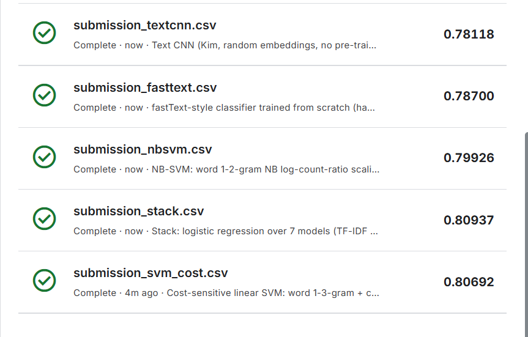

## Results

All seven models were trained on the same five stratified folds (`results/folds.csv`). Scores below are **out-of-fold (OOF)**: every
tweet is scored by a model that never saw it. F1 is for the disaster class at the F1-optimal threshold chosen on the OOF scores,
with a 95% bootstrap interval over tweets. Public scores are from the Kaggle leaderboard (`results/kaggle_public_scores.json`);
the standard error of an accuracy near 0.80 on 3,263 test tweets is about 0.007.

| Model | OOF F1 [95% CI] | OOF AUC | OOF accuracy | Public score |
|---|---|---|---|---|
| **Stack of all 7** | 0.7752 [0.764, 0.787] | 0.8748 | — | **0.80937** |
| Cost-sensitive linear SVM | **0.7757** [0.766, 0.787] | 0.8743 | 0.8094 | 0.80692 |
| TF-IDF + logistic regression (baseline) | 0.7720 [0.762, 0.783] | 0.8736 | — | not submitted |
| NB-SVM | 0.7669 [0.756, 0.778] | 0.8656 | 0.8043 | 0.79926 |
| Complement Naive Bayes | 0.7639 [0.753, 0.775] | 0.8609 | 0.8030 | not submitted |
| fastText-style (from scratch) | 0.7571 [0.746, 0.768] | 0.8580 | 0.7900 | 0.78700 |
| Gradient-boosted trees on topics + features | 0.7480 [0.738, 0.759] | 0.8482 | 0.7771 | not submitted |
| Text CNN (from scratch) | 0.7397 [0.728, 0.751] | 0.8440 | 0.7801 | 0.78118 |

Sources: `results/comparison_summary.json`, `results/traditional_summary.csv`, `results/meta_*.json`, `results/accuracy_vs_f1.json`,
`results/kaggle_public_scores.json`. OOF accuracy is at each model's F1-optimal threshold.

**What the numbers say**
- The ranking offline and on the leaderboard agree: SVM > NB-SVM > fastText > CNN. Each public score is within about 0.005 of the
  model's OOF accuracy, so cross-validation on this data predicts the leaderboard well (adversarial validation, below, found the
  train and test tweets indistinguishable).
- Paired bootstrap on the 7,613 OOF tweets (95% interval excludes 0): the SVM is ahead of every model except the baseline (differences
  +0.009 to +0.036 F1); the baseline is ahead of Complement NB, the tree model, fastText and the CNN (+0.008 to +0.032) but not of NB-SVM;
  fastText is ahead of the CNN (+0.017). The SVM and the baseline cannot be separated (+0.004), and neither can fastText and the tree model.
- **Stacking all seven adds nothing measurable**: F1 −0.0005 against the best single model (95% interval −0.005 to +0.004).
  The models' errors overlap heavily; 717 tweets (9.4%) are misclassified by all seven.
- The leaderboard metric is accuracy but the thresholds were tuned for positive-class F1 (42% of tweets predicted positive).
  At the accuracy-optimal threshold the SVM's OOF accuracy rises from 0.8094 to 0.8181 while its F1 falls from 0.7757 to 0.7629
  (`results/accuracy_vs_f1.json`). The submitted files use the F1 threshold.

## The seven methods

| # | Method | Idea | Reference |
|---|---|---|---|
| 1 | TF-IDF + logistic regression | word 1–2-gram + character 2–5-gram TF-IDF, keyword as a token | baseline |
| 2 | **NB-SVM** | scale each n-gram feature by its Naive Bayes log-count ratio, then a linear SVM | Wang & Manning, ACL 2012 |
| 3 | **Complement Naive Bayes** | estimate each class from the documents *outside* it; TF-IDF input | Rennie et al., ICML 2003 |
| 4 | **Cost-sensitive linear SVM** | word 1–3-gram + char 2–5-gram TF-IDF; positive-class weight and threshold chosen on OOF scores | Lin et al. 2023; Yang 2001; Parambath et al. 2014 |
| 5 | **Gradient-boosted trees** | LightGBM on 100 SVD topics + empirical-Bayes keyword rate + surface features | EDA-driven design |
| 6 | **fastText-style** | mean of word and hashed-bigram embeddings → linear; random initialisation, local GPU | Joulin et al. 2016 |
| 7 | **Text CNN** | random embeddings, widths 2/3/4 convolutions, max-over-time pooling; local GPU | Kim 2014 |
| — | **Stack** | logistic regression over the seven standardised OOF scores | — |

## Key mathematical results

**Metric.** With two classes, micro-averaged precision, recall and F1 all equal accuracy, so the leaderboard score is accuracy.
Positive-class F1 is $`F_1=2\,\mathrm{TP}/(2\,\mathrm{TP}+\mathrm{FP}+\mathrm{FN})`$; maximising it favours a lower threshold (more positives) than
maximising accuracy, which is why the two metrics prefer different thresholds.

**Keyword prior (empirical Bayes).** Raw per-keyword rates are noisy for rare keywords, so each is shrunk toward the global rate
with a Beta prior fitted by the method of moments:
$$\hat p_k=\frac{y_k+a}{n_k+a+b},\qquad (a,b)=\Big(m\,c,\;(1-m)\,c\Big),\; c=\frac{m(1-m)}{\mathrm{Var}(r_k)}-1 .$$
Fitted prior: Beta(0.99, 1.34); the shrunk rate alone has out-of-fold AUC **0.788**.

**Words that separate the classes (weighted log-odds with an informative Dirichlet prior).**
$$\delta_w=\log\frac{y^1_w+\alpha_w}{n^1+\alpha_0-y^1_w-\alpha_w}-\log\frac{y^0_w+\alpha_w}{n^0+\alpha_0-y^0_w-\alpha_w},\qquad z_w=\frac{\delta_w}{\sqrt{1/(y^1_w+\alpha_w)+1/(y^0_w+\alpha_w)}} .$$

**NB-SVM.** For binary n-gram features $`f`$, class counts $`p=\alpha+\sum_{y_i=1}f_i`$ and $`q=\alpha+\sum_{y_i=0}f_i`$,
$$r=\log\frac{p/\lVert p\rVert_1}{q/\lVert q\rVert_1},\qquad \tilde f=r\circ f,$$
and a linear SVM is fitted on $`\tilde f`$. Selected: $`\alpha=4`$, $`C=0.03`$ (a flat optimum; AUC varied by about 0.001 across the grid).

**Complement Naive Bayes.** Parameters come from the documents *not* in class $`c`$,
$$\tilde\theta_{c,w}=\frac{\alpha+\sum_{i:y_i\ne c}d_{iw}}{\alpha V+\sum_{i:y_i\ne c}\sum_{w'}d_{iw'}},$$
and a tweet is assigned to the class whose complement fits it worst. Selected: $`\alpha=0.5`$.

**Cost-sensitive SVM.** The squared-hinge objective with a class weight $`c_1=w`$ on positives,
$$\min_{\mathbf w}\ \tfrac12\lVert\mathbf w\rVert^2+C\sum_i c_{y_i}\max\big(0,\,1-y_i\mathbf w^{\top}\mathbf x_i\big)^2 ,$$
then a margin threshold fixed on OOF scores. Selected by AUC: $`C=0.1`$, $`w=1`$. Up-weighting positives did not improve AUC; with a tuned threshold it is
equivalent to shifting the boundary, so the grid's F1 surface is flat in $`w`$.

**fastText-style classifier.** A tweet is the multiset of its unigrams and hashed bigrams $`g`$ (CRC-32 into 50,000 buckets),
$$\hat y=\sigma\Big(\mathbf w^{\top}\tfrac1{|d|}\textstyle\sum_{g\in d}\mathbf e_g+b\Big),\quad \mathbf e_g\in\mathbb R^{16},$$
trained with AdamW and dropout 0.5; the epoch with the lowest inner-holdout log loss is kept.

**Text CNN.** For filter width $`h\in\{2,3,4\}`$ and filter $`f`$,
$`c^{(f)}_i=\mathrm{ReLU}(\mathbf w_f\cdot\mathbf x_{i:i+h-1}+b_f)`$ and $`\hat c_f=\max_i c^{(f)}_i`$; the pooled vector (3 widths × 64 filters) goes through dropout
0.5 and a linear layer. Each filter is a learned n-gram detector.

**Stacking.** Each model's OOF score is put on a common scale (logit for probabilities, otherwise the raw margin; then standardised with the OOF mean and standard deviation) and combined,
$$\mathrm{logit}P(y{=}1)=b+\sum_{m=1}^{7}w_m z_m ,\qquad C=0.03 .$$
Weights: baseline 0.51, SVM 0.50, NB-SVM 0.40, Complement NB 0.27, GBDT 0.21, fastText 0.18, CNN 0.14.

**Paired bootstrap for F1 differences.** Tweets are resampled with replacement 2,000–4,000 times; both models' F1 are computed on the same resample, and the 2.5th and 97.5th percentiles of the difference form the interval.
This is the right test because the models are scored on the same tweets; unpaired intervals (bars in the F1 figure) overlap heavily.

**Adversarial validation.** A classifier trained to tell training from test tweets reaches out-of-fold AUC **0.486**, i.e. chance: the two sets are exchangeable, so cross-validation estimates the test score.

**Label-noise ceiling (derived, with an assumption).** Near-identical tweet pairs (TF-IDF cosine ≥ 0.9; 17% of tweets) carry different labels 16.8% of the time. If two labels disagree with probability $`d=2\varepsilon(1-\varepsilon)`$ for independent per-label error $`\varepsilon`$,
$`\varepsilon=\tfrac12\big(1-\sqrt{1-2d}\big)\approx 9.3\%`$, which would cap accuracy near 90% (`results/near_duplicates.json`). This is an estimate; the independence assumption is not verified.

## Visualizations

### Data understanding
Class balance, missing metadata, label noise, which words and keywords separate the classes, and whether the test set resembles the training set. Notebook: `01_data_understanding.ipynb`.

<table>
<tr><td colspan="2">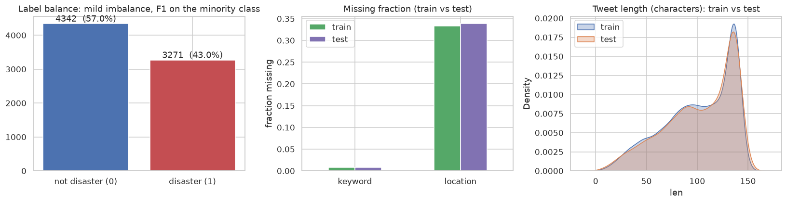<br><sub>Label balance (43% disaster), missing fraction of keyword/location, tweet-length distribution. Source: notebook 01.</sub></td></tr>
<tr>
<td width="50%">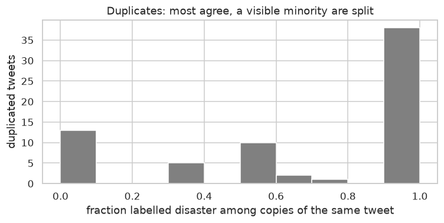<br><sub>Duplicated tweets: most copies agree, a visible minority are split. <code>results/label_noise.json</code></sub></td>
<td width="50%">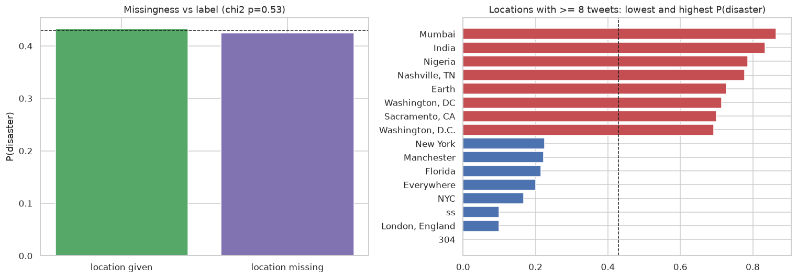<br><sub>Location missingness is unrelated to the label (χ² p = 0.53); location carries little signal.</sub></td>
</tr>
<tr><td colspan="2">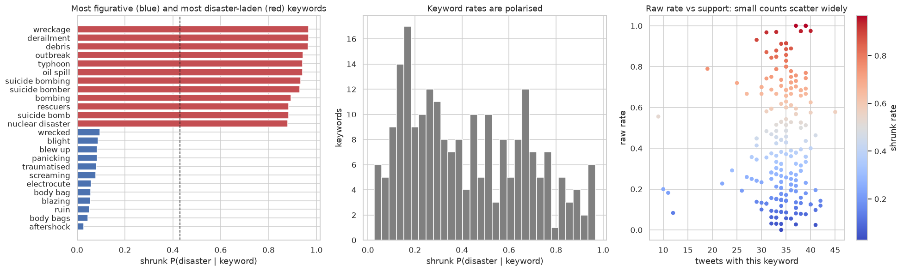<br><sub>Keywords are polarised; shrunk rates (empirical Bayes) separate figurative from disaster use; keyword alone gives AUC 0.788.</sub></td></tr>
<tr><td colspan="2">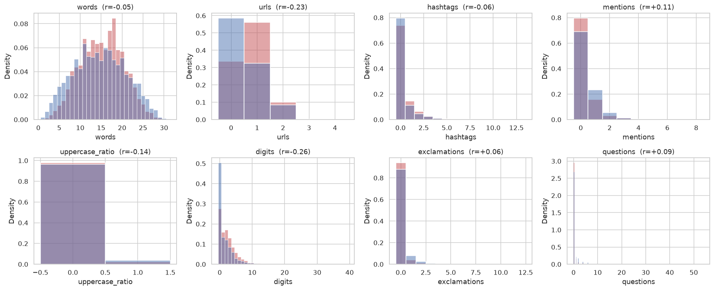<br><sub>Surface features per class with rank-biserial effect sizes. <code>results/surface_feature_tests.csv</code></sub></td></tr>
<tr>
<td width="50%">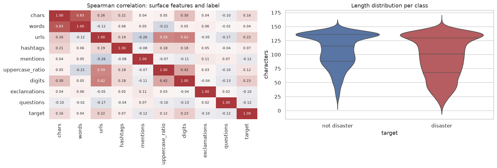<br><sub>Spearman correlation of surface features and label; length distribution per class.</sub></td>
<td width="50%">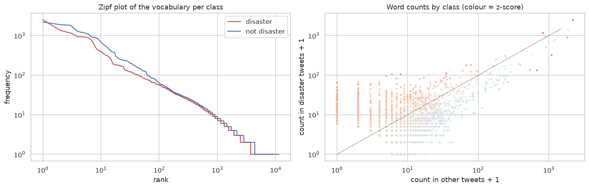<br><sub>Zipf plots and class-conditional word counts (colour = log-odds z-score).</sub></td>
</tr>
<tr>
<td width="50%">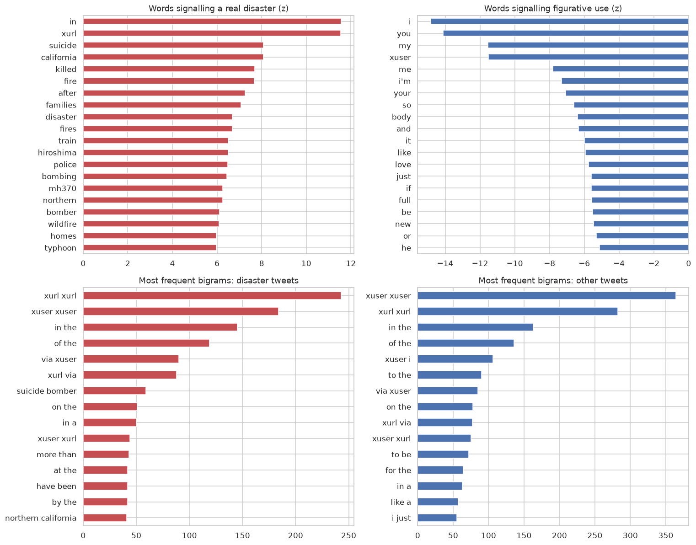<br><sub>Discriminative words (weighted log-odds) and most frequent bigrams per class.</sub></td>
<td width="50%">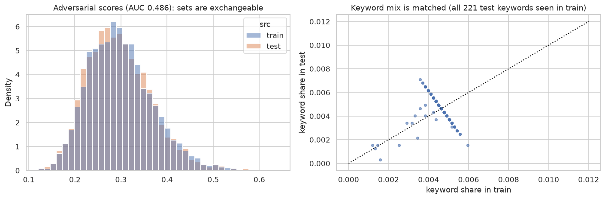<br><sub>Adversarial validation (AUC 0.486) and keyword mix: train and test match. <code>results/adversarial_validation.json</code></sub></td>
</tr>
<tr><td colspan="2">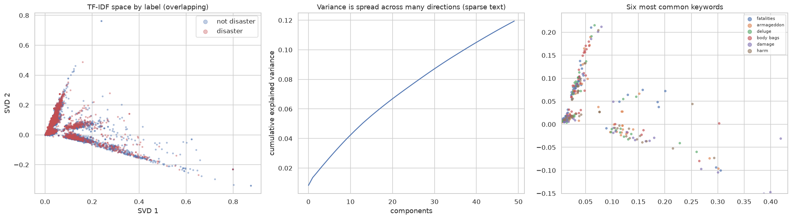<br><sub>Two-dimensional SVD projection of TF-IDF space: the classes overlap heavily, which is why bag-of-words has a ceiling.</sub></td></tr>
</table>

### Baseline: TF-IDF + logistic regression
Regularisation sweep, feature-group ablation, diagnostics and error slices. Notebook: `02_tfidf_baseline.ipynb`; results `results/v1_tfidf_eval.json`.

<table>
<tr><td colspan="2">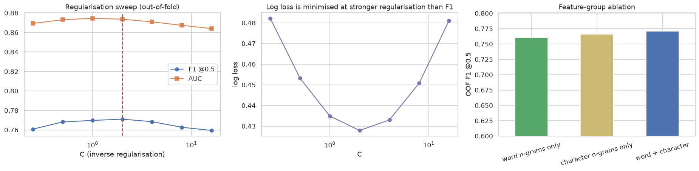<br><sub>Out-of-fold AUC and log loss against C; word-only, character-only and combined features.</sub></td></tr>
<tr><td colspan="2">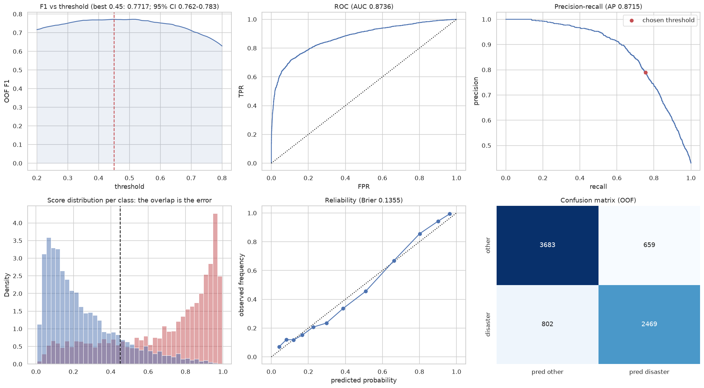<br><sub>F1 against threshold, ROC, precision-recall, score distribution, reliability, confusion matrix.</sub></td></tr>
<tr>
<td width="50%">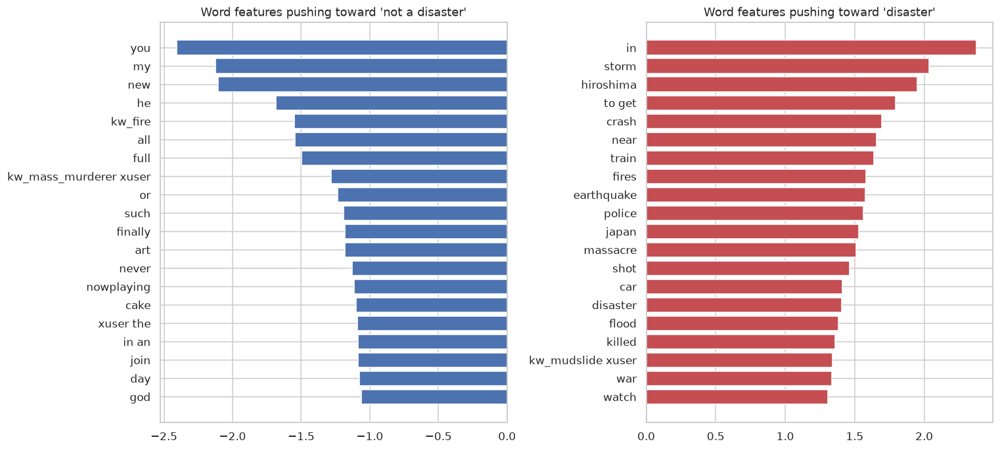<br><sub>Largest word coefficients pushing toward each class.</sub></td>
<td width="50%">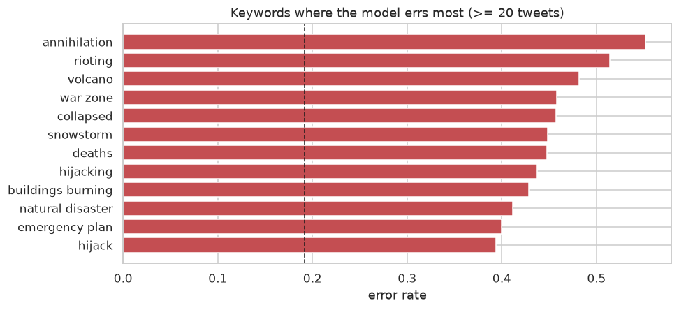<br><sub>Keywords with the highest error rate (≥ 20 tweets).</sub></td>
</tr>
<tr><td colspan="2">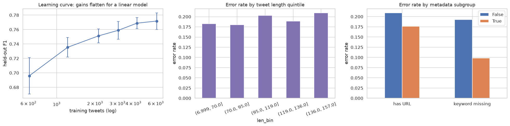<br><sub>Learning curve (gains flatten: F1 0.769 at 4,263 training tweets, 0.772 at 6,090), error rate by length and by URL / missing keyword.</sub></td></tr>
</table>

### Traditional methods: NB-SVM, Complement NB, cost-sensitive SVM
Notebook: `03_traditional_methods.ipynb`. These models have no epochs, so the "in-training" view is the hyper-parameter surface each was selected on.

<table>
<tr><td colspan="2">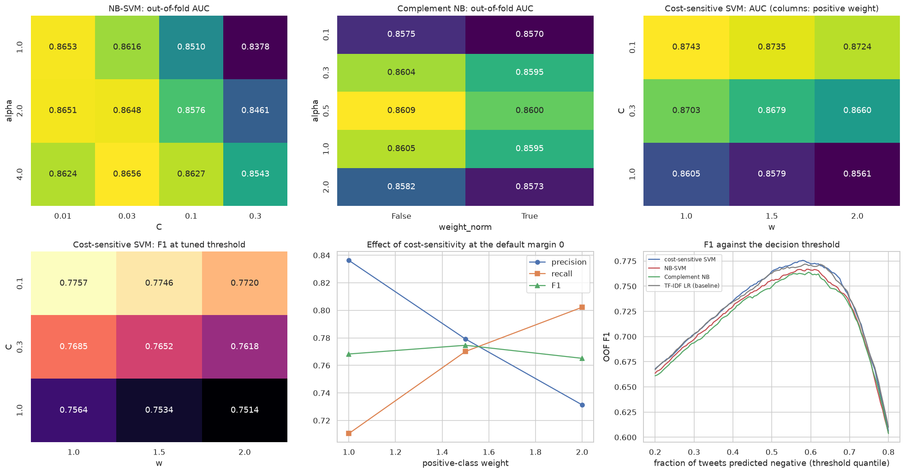<br><sub>AUC over each grid; the SVM's F1 surface; effect of the positive-class weight; F1 against threshold.</sub></td></tr>
<tr><td colspan="2">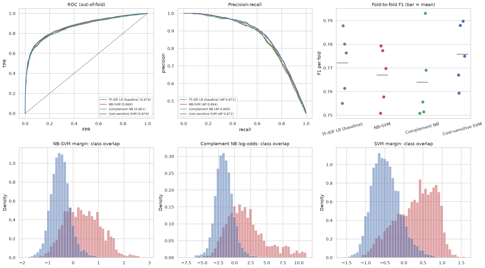<br><sub>ROC and precision-recall against the baseline, per-fold F1, score distributions. <code>results/traditional_summary.csv</code></sub></td></tr>
<tr><td colspan="2">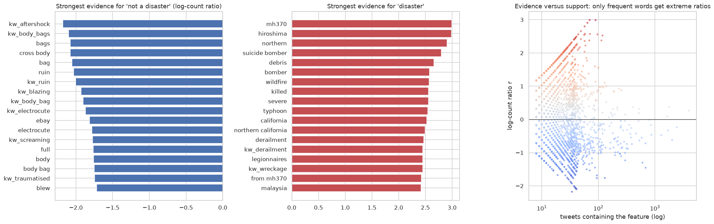<br><sub>NB-SVM log-count ratios: strongest evidence for each class, and evidence against support.</sub></td></tr>
</table>

### Gradient-boosted trees on topics and engineered features
Notebook: `04_gradient_boosting_features.ipynb`. The keyword encoding of a *training* row is computed from other inner folds, so a row never sees its own label.

<table>
<tr><td colspan="2">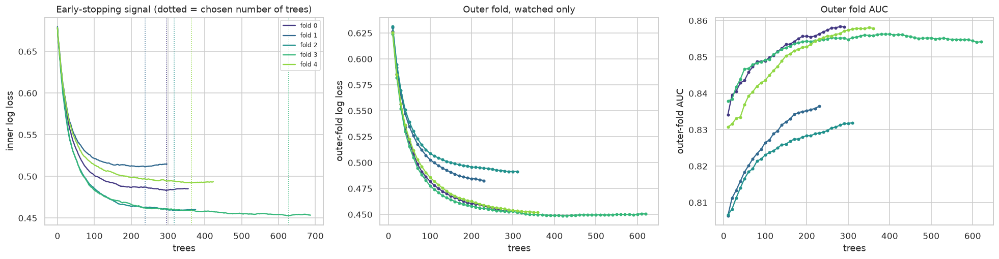<br><sub>Per-fold early-stopping signal (inner log loss; dotted = chosen trees, 238–628 of a 1,500 cap) and the watched outer-fold log loss and AUC every 10 trees.</sub></td></tr>
<tr><td colspan="2">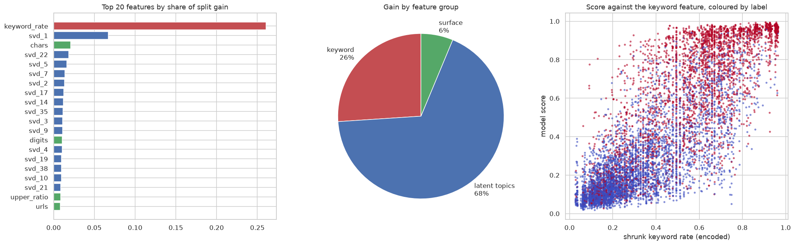<br><sub>Top features by split gain, gain share per feature group, and model score against the keyword feature.</sub></td></tr>
<tr><td colspan="2">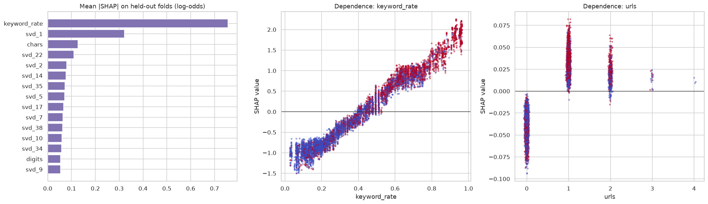<br><sub>Mean |SHAP| on held-out folds and dependence plots for the keyword rate and URL count.</sub></td></tr>
<tr>
<td width="50%">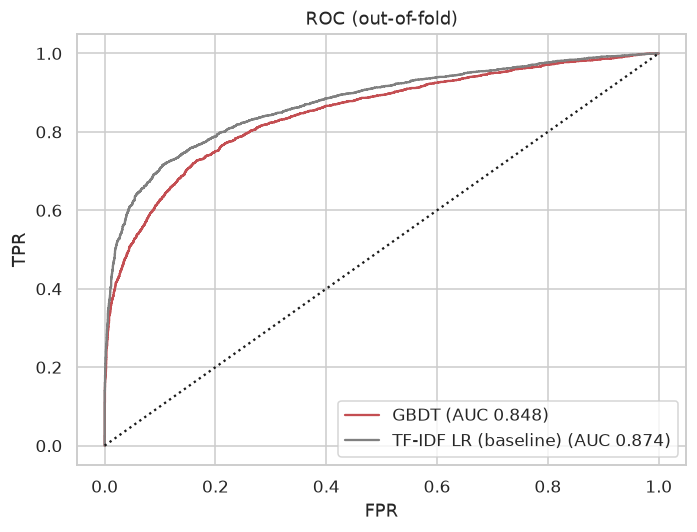<br><sub>ROC against the baseline (AUC 0.848 against 0.874).</sub></td>
<td width="50%">

Trees recover the keyword's strength and the URL effect but see a tweet only through 100 dense SVD topics, which discard most of the
vocabulary; they trail the baseline and the SVM by 0.024 and 0.028 F1 (paired test, 95% interval excludes 0).

</td>
</tr>
</table>

### fastText-style classifier (local GPU)
Notebook: `05_fasttext.ipynb`; training script `train_dl.py`. Statistics are collected every epoch and drawn afterwards; the outer fold is watched only.

<table>
<tr><td colspan="2">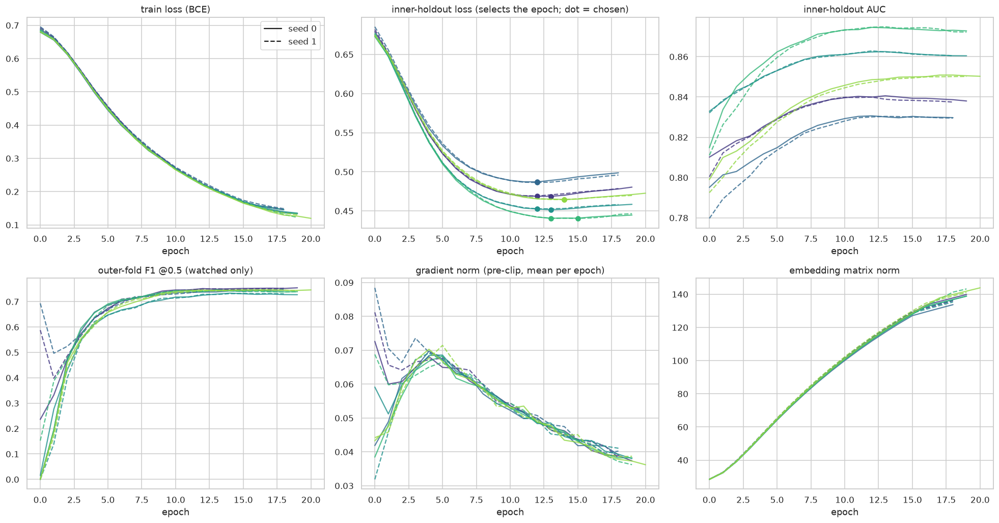<br><sub>Per fold and seed: train loss, inner-holdout loss (dot = chosen epoch), inner AUC, outer-fold F1, gradient norm, embedding norm. <code>results/dl_history_fasttext.json</code></sub></td></tr>
<tr><td colspan="2">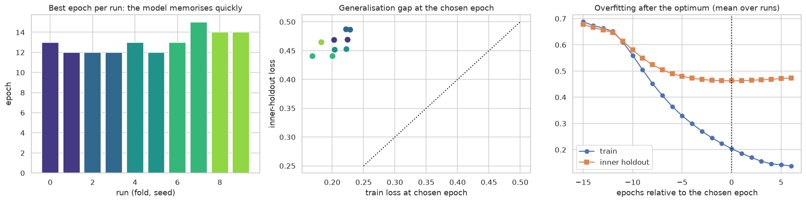<br><sub>Best epoch per run (12–15), train/holdout loss at the optimum, and overfitting after it.</sub></td></tr>
<tr><td colspan="2">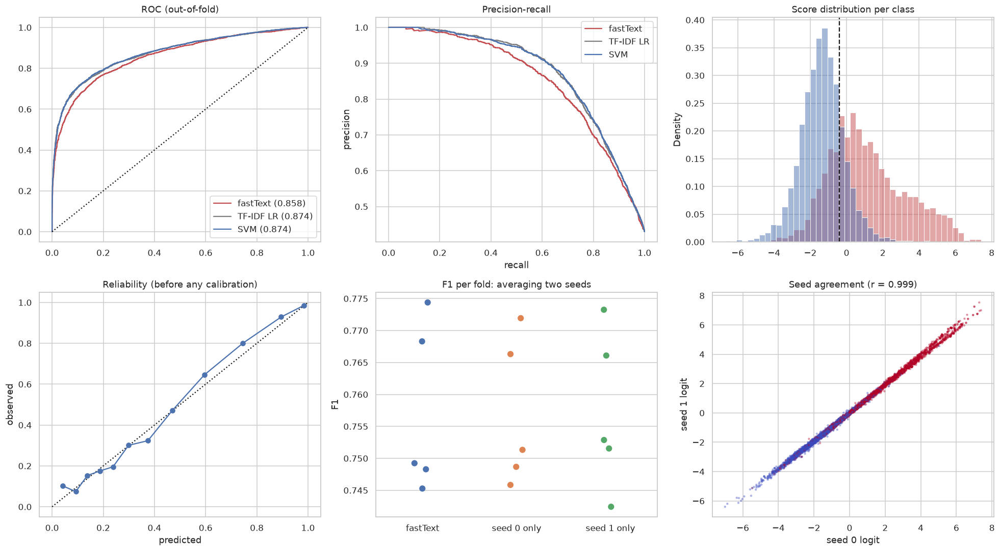<br><sub>ROC and precision-recall against the baseline and SVM, score distribution, reliability, per-fold F1 of one seed against two, seed agreement.</sub></td></tr>
<tr><td colspan="2">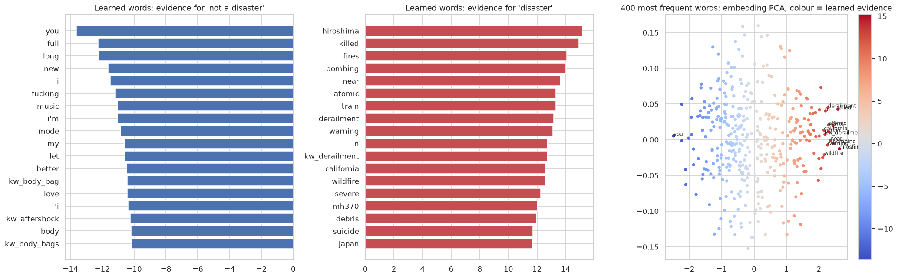<br><sub>Learned word evidence (centred) and a PCA of the 400 most frequent word embeddings coloured by that evidence.</sub></td></tr>
</table>

### Text CNN (local GPU)
Notebook: `06_text_cnn.ipynb`; training script `train_dl.py`.

<table>
<tr><td colspan="2">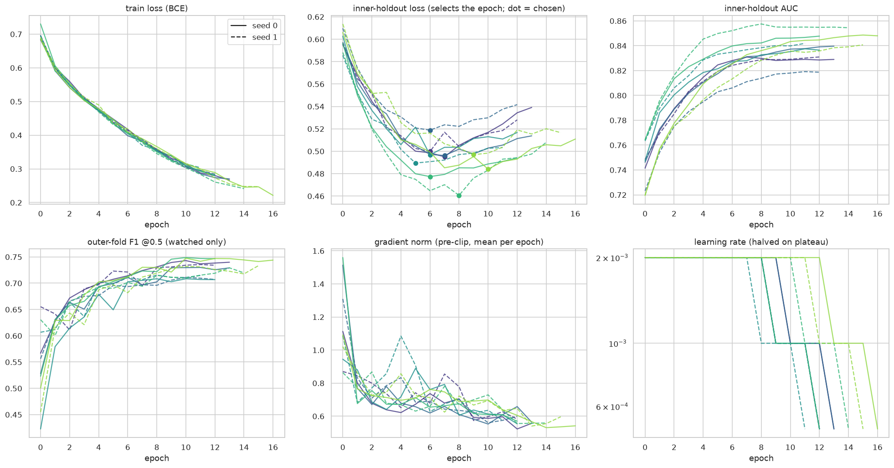<br><sub>Train loss, inner-holdout loss, inner AUC, outer-fold F1, gradient norm and learning rate (halved on plateau). <code>results/dl_history_textcnn.json</code></sub></td></tr>
<tr><td colspan="2">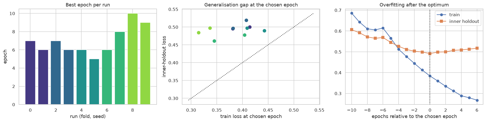<br><sub>Best epoch (5–10), generalisation gap at the optimum, overfitting after it.</sub></td></tr>
<tr><td colspan="2">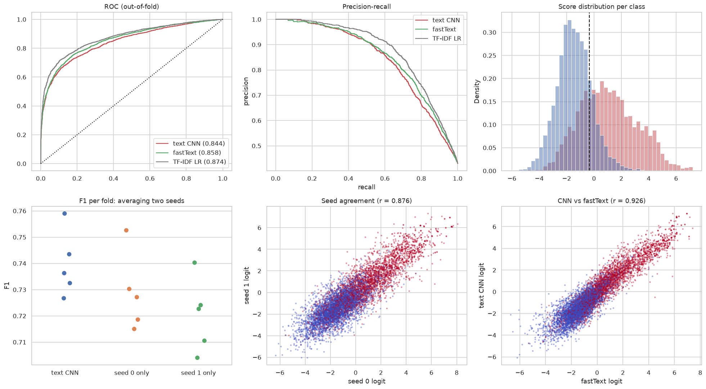<br><sub>ROC and precision-recall against fastText and the baseline, score distribution, seed averaging (single seeds 0.729 and 0.720 F1, average 0.740), and agreement with fastText.</sub></td></tr>
<tr>
<td width="50%">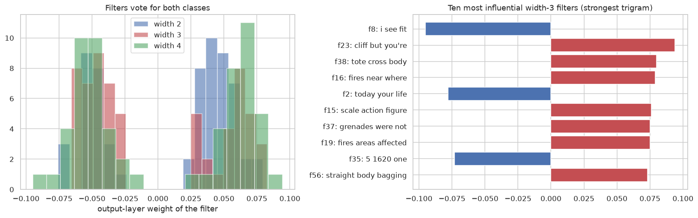<br><sub>Output-layer weights per filter width and the ten most influential width-3 filters with their strongest trigram.</sub></td>
<td width="50%">

Filters act as n-gram detectors: "fires near where", "fires areas affected" and "grenades were not" vote *disaster*;
"i see fit" and "today your life" vote *not a disaster*.

</td>
</tr>
<tr><td colspan="2">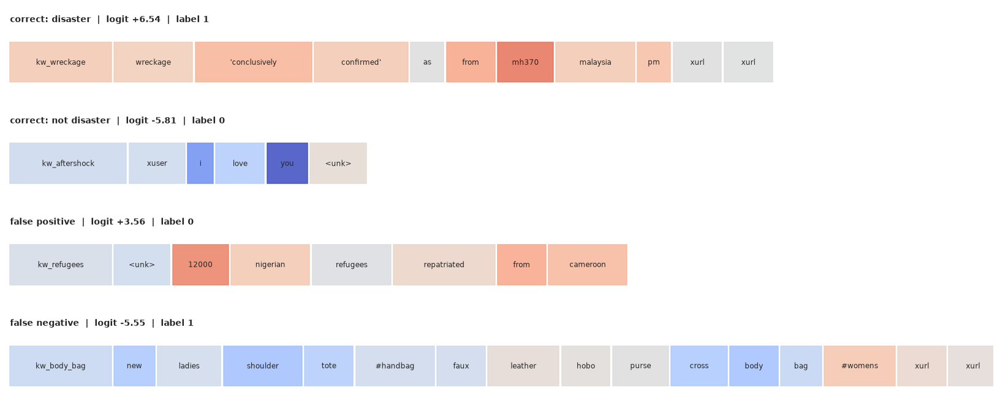<br><sub>Gradient × embedding saliency on held-out tweets: a confident hit, a confident negative, a false positive and a false negative (a handbag advertisement labelled as a disaster).</sub></td></tr>
</table>

### Comparison, stacking and error analysis
Notebook: `07_comparison_and_stacking.ipynb`; summary `results/comparison_summary.json`.

<table>
<tr><td colspan="2">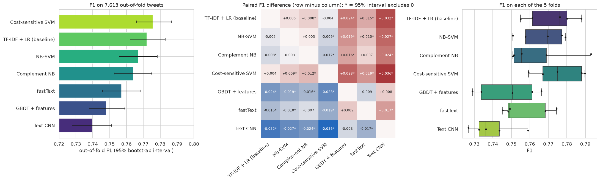<br><sub>OOF F1 with bootstrap intervals, paired F1 differences (* = interval excludes 0), F1 on each fold.</sub></td></tr>
<tr><td colspan="2">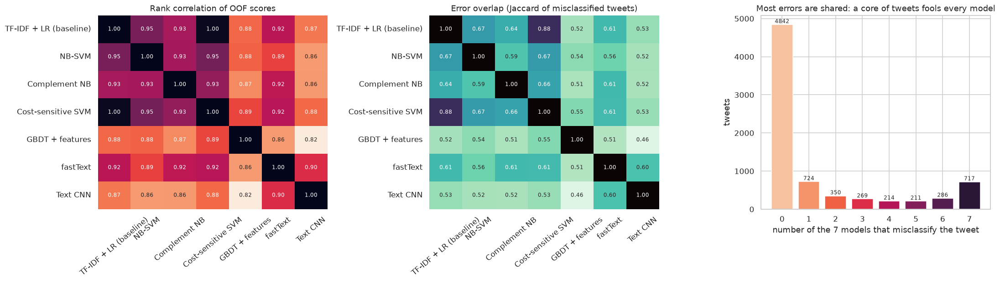<br><sub>Rank correlation of scores, overlap of misclassified tweets, and how many of the seven models are wrong on each tweet.</sub></td></tr>
<tr><td colspan="2">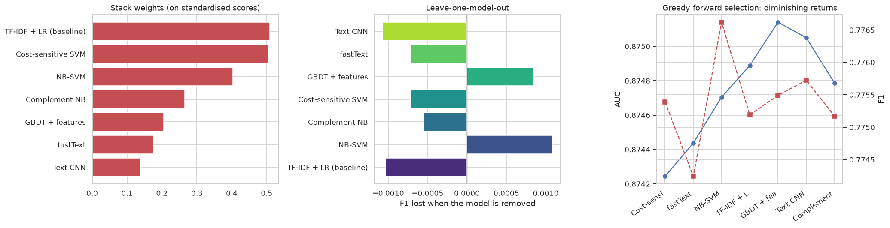<br><sub>Stack weights, leave-one-model-out F1 loss, greedy forward selection: diminishing returns.</sub></td></tr>
<tr><td colspan="2">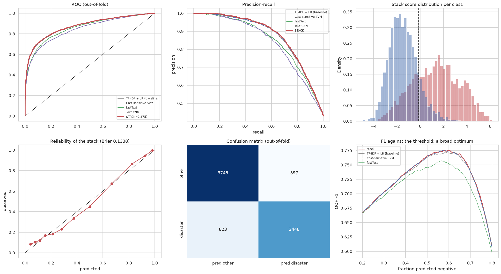<br><sub>Stack: ROC, precision-recall, score distribution, reliability, confusion matrix, F1 against threshold (a broad optimum).</sub></td></tr>
<tr><td colspan="2">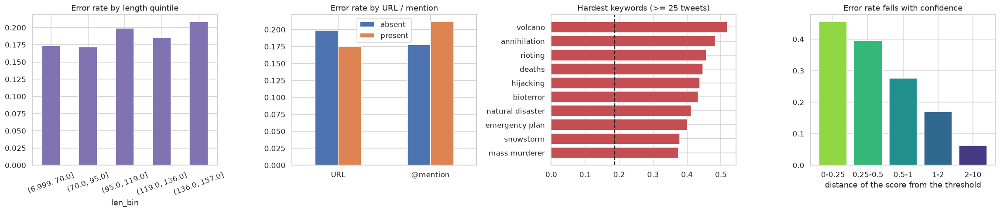<br><sub>Error rate by length, URL/mention, keyword, and confidence; the most confident mistakes are listed in the notebook.</sub></td></tr>
<tr>
<td width="50%">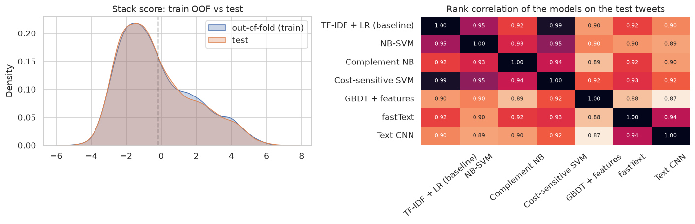<br><sub>Stack score on train OOF against test (KS D = 0.019, p = 0.39) and rank correlation of the models on the test tweets.</sub></td>
<td width="50%">

The test score distribution matches the OOF one, and the predicted positive rate on test (38.7%) is close to the OOF rate (40.0%),
so there is no sign of train/test drift in the submission.

</td>
</tr>
</table>

## Convergence audit: nothing is under-trained

Measured in `diagnostics.py` (`results/convergence_audit.json`):

| Model | Evidence |
|---|---|
| Linear, NB-SVM, SVM, Complement NB | 0 solver-convergence warnings in any notebook |
| fastText | best epoch 12–15; 8 of 10 runs stopped by patience, none hit the 40-epoch cap; train/holdout loss gap 0.26 at the optimum |
| Text CNN | best epoch 5–10; 10 of 10 runs stopped by patience, none hit the 30-epoch cap; gap 0.11 |
| GBDT | 238–628 trees against a cap of 1,500 |

The neural models overfit within a handful of epochs, and the baseline's learning curve flattens: the limit is data and features, not optimisation.

## Where the error is, and the ceiling

Near-duplicate analysis (`results/near_duplicates.json`; TF-IDF cosine on text with URLs and mentions removed):

| Subset | Tweets | SVM accuracy |
|---|---|---|
| Near-duplicate in another fold, cosine 0.8–1.0 | 1,242 | 0.87 (copying the neighbour's label: 0.84–0.86) |
| No close neighbour (cosine < 0.6) | 5,738 | **0.79** |

Tweets with a close neighbour are already near the label-noise ceiling. The three quarters of the data with no neighbour are where a model must
understand the sentence ("this song is fire" against a fire report), which is the knowledge a pre-trained language model supplies and this study excludes.
Duplicates whose labels disagree are misclassified 58% of the time against 18% elsewhere; the most confident "errors" are often mislabelled tweets
(a handbag advertisement, song lyrics, "I can blaze inside my apt" labelled as disasters).

## Lessons

1. **Check what the leaderboard measures.** Tuning thresholds for positive-class F1 while the metric is accuracy left about 0.009 accuracy on the table.
2. **Compare models on the same folds, with paired tests.** Overlapping intervals hid real differences (the SVM beats fastText by 0.019 F1) and exaggerated none.
3. **Strong simple baselines are hard to beat on 7.6k tweets.** The best single model is a linear SVM on character and word n-grams.
4. **Stacking needs diversity.** Three of the seven models are linear TF-IDF variants, and the neural models were weaker on their own, so the stack gained nothing.
5. **A bug found late:** the first normaliser deleted its own URL and mention markers (it inserted upper-case tokens and then stripped upper case). It was fixed and every result here was recomputed with the fixed version.

## Limitations and future work

- Hyper-parameters and thresholds were selected on the OOF scores that are also reported, which is slightly optimistic and equally so for all methods; the stacker is cross-validated on the OOF matrix (the usual stacking approximation).
- The public leaderboard is a single split of 3,263 tweets (standard error about 0.007), so differences below about 0.01 are not resolvable there.
- The label-noise estimate assumes independent annotator errors.
- Untried, in rough order of expected value: noise-aware training (down-weighting rows whose cross-validated score contradicts their label); richer classical features
  (stemming, elongation and number normalisation, hashtag splitting, longer character n-grams, lexicons built from training data only); more seeds and stronger regularisation for the neural models
  (two seeds already lifted the CNN from 0.725 to 0.740); semi-supervised use of the unlabelled test text; repeated cross-validation to resolve small differences.

## Reproducing

Python 3.12; tested with numpy 2.5, pandas 3.0, scikit-learn 1.9, scipy 1.18, LightGBM 4.7, PyTorch 2.13 (CUDA 12.9), matplotlib 3.11, seaborn 0.13.
The two neural models used a 4 GB laptop GPU; every step runs in under 90 seconds.

```bash
pip install -r requirements.txt
# download train.csv, test.csv, sample_submission.csv from the competition page into data/ (competition data is not redistributed here)
python3 tests/test_nlp.py                      # 19 unit checks: normaliser, NB ratio, hashing, masked mean, bootstrap, training loop
jupyter nbconvert --to notebook --execute --inplace 01_data_understanding.ipynb   # run the notebooks in numeric order
python3 train_dl.py fasttext && python3 train_dl.py textcnn   # resumable GPU training (creates checkpoints/); notebooks 05 and 06 assemble the saved runs and load the fold-0 checkpoint for the learned-word, filter and saliency views
python3 diagnostics.py                         # accuracy vs F1, convergence audit, near-duplicate / noise estimate
python3 make_submissions.py                    # one submission CSV per model
```

| File | Content |
|---|---|
| `01_data_understanding.ipynb` | missingness, label noise, keyword/location/surface features, discriminative words, adversarial validation, SVD projection |
| `02_tfidf_baseline.ipynb` | baseline, fixed folds (`results/folds.csv`), sweep, ablation, diagnostics |
| `03_traditional_methods.ipynb` | NB-SVM, Complement NB, cost-sensitive SVM |
| `04_gradient_boosting_features.ipynb` | LightGBM on SVD topics + engineered features, SHAP |
| `05_fasttext.ipynb`, `06_text_cnn.ipynb` | from-scratch neural models: statistics, post-training analysis |
| `07_comparison_and_stacking.ipynb` | paired tests, diversity, stacking, error analysis, submissions |
| `nlp_common.py`, `nlp_dl.py`, `train_dl.py` | shared helpers, models and training loop, resumable training script |
| `diagnostics.py`, `make_submissions.py` | accuracy/convergence/noise diagnostics; submission files |
| `tests/test_nlp.py` | unit tests |
| `results/` | OOF and test scores per model, per-epoch histories and per-run predictions (`dl_runs/`), summaries, `PROVENANCE.md` |
| `submission.csv`, `submissions/` | the stack (best public score) and one file per model |

## References

- S. Wang, C. D. Manning. *Baselines and Bigrams: Simple, Good Sentiment and Topic Classification.* ACL 2012.
- J. D. M. Rennie, L. Shih, J. Teevan, D. R. Karger. *Tackling the Poor Assumptions of Naive Bayes Text Classifiers.* ICML 2003.
- Y.-C. Lin, S.-A. Chen, J.-J. Liu, C.-J. Lin. *Linear Classifier: An Often-Forgotten Baseline for Text Classification.* 2023. arXiv:2306.07111.
- Y. Yang. *A Study on Thresholding Strategies for Text Categorization.* SIGIR 2001. S. P. Parambath, N. Usunier, Y. Grandvalet. *Optimizing F-measures by Cost-Sensitive Classification.* NeurIPS 2014.
- A. Joulin, E. Grave, P. Bojanowski, T. Mikolov. *Bag of Tricks for Efficient Text Classification.* 2016. arXiv:1607.01759.
- Y. Kim. *Convolutional Neural Networks for Sentence Classification.* EMNLP 2014. arXiv:1408.5882.
- B. L. Monroe, M. P. Colaresi, K. M. Quinn. *Fightin' Words: Lexical Feature Selection and Evaluation for Identifying the Content of Political Conflict.* Political Analysis 2008.
- L. Galke, A. Scherp et al. *Are We Really Making Much Progress in Text Classification? A Comparative Review.* 2022. arXiv:2204.03954.
- G. Ke et al. *LightGBM: A Highly Efficient Gradient Boosting Decision Tree.* NeurIPS 2017. S. M. Lundberg, S.-I. Lee. *A Unified Approach to Interpreting Model Predictions.* NeurIPS 2017.
