# kaggle-basics

Kaggle competitions solved end-to-end — not just a submitted CSV, but data understanding,
in-training monitoring, and post-training diagnostics for every one. Each competition gets its
own folder with a full notebook, an exported-plot gallery, a scored submission, and a public
Kaggle notebook link.

## Competitions #1-3: same pipeline, different data

These three all use the identical LightGBM 5-fold CV pipeline (same code shape, same diagnostic
suite) — the point of grouping them is to compare how the *same* method behaves across *different*
datasets, not to show the pipeline three times. The dataset differences below are what actually
varies between them and what each notebook had to account for.

| | [#1 Airline Satisfaction](01-predicting-airline-satisfaction/) | [#2 EV Purchases](02-predicting-ev-purchases/) | [#3 Smartphone Addiction](03-predicting-smartphone-addiction/) |
|---|---|---|---|
| Rows (train / test) | ~940k / ~470k | ~670k / ~287k | ~691k / ~296k |
| Features | 22, all complete | 15, all complete | 13, **up to 19% missing per column** |
| Target balance | 44% / 56% | **17% / 83%** (minority = Yes) | **71% / 29%** (majority = addicted) |
| Metric | ROC AUC | ROC AUC | ROC AUC |
| CV ROC AUC | 0.95880 ± 0.00058 | 0.94164 ± 0.00080 | 0.96364 ± 0.00056 |
| Leaderboard | 0.95827 | 0.94093, public 0.94144 | 0.96506, public 0.96524 |
| Notebook-specific step | Thread-scaling benchmark before picking parallelization strategy | Explains why ROC AUC still holds under a 17/83 imbalance | Missingness audit (train vs. test agree) + explicit missing-indicator features |

Visualizations below are grouped by **chart type**, not by competition — each row puts the three
notebooks' version of the same chart side by side, so the comparison is the point rather than
three repeated blocks.

**SHAP summary:**

<table>
<tr>
<td width="33%"></td>
<td width="33%"></td>
<td width="33%">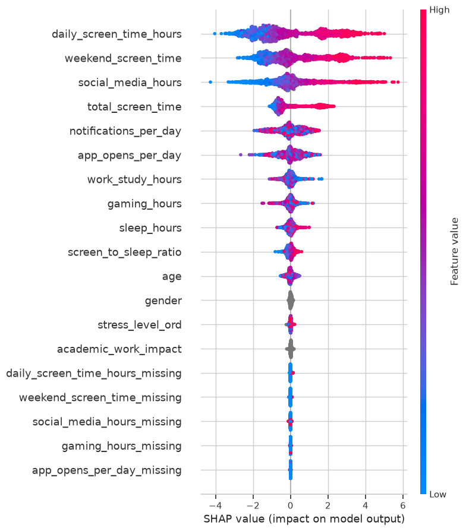</td>
</tr>
<tr>
<td width="33%" align="center">#1 Airline</td>
<td width="33%" align="center">#2 EV Purchases</td>
<td width="33%" align="center">#3 Smartphone Addiction</td>
</tr>
</table>

**Correlation structure:**

<table>
<tr>
<td width="33%"></td>
<td width="33%"></td>
<td width="33%">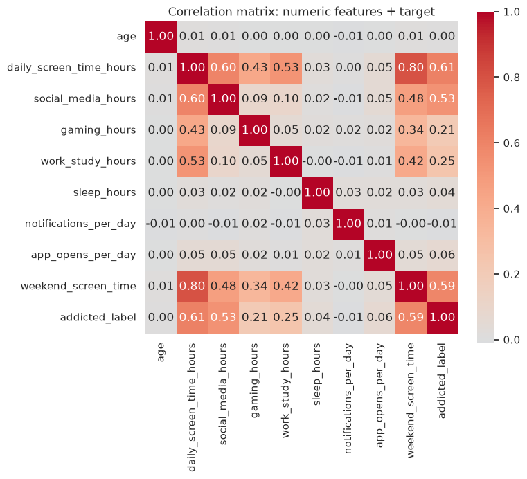</td>
</tr>
<tr>
<td width="33%" align="center">#1 Airline</td>
<td width="33%" align="center">#2 EV Purchases</td>
<td width="33%" align="center">#3 Smartphone Addiction</td>
</tr>
</table>

**In-training learning curve:**

<table>
<tr>
<td width="33%"></td>
<td width="33%"></td>
<td width="33%">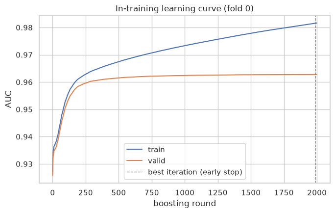</td>
</tr>
<tr>
<td width="33%" align="center">#1 Airline</td>
<td width="33%" align="center">#2 EV Purchases</td>
<td width="33%" align="center">#3 Smartphone Addiction (note: several folds ran close to the full
round budget here — noisier data than #1/#2)</td>
</tr>
</table>

**Feature importance (gain):**

<table>
<tr>
<td width="33%"></td>
<td width="33%"></td>
<td width="33%">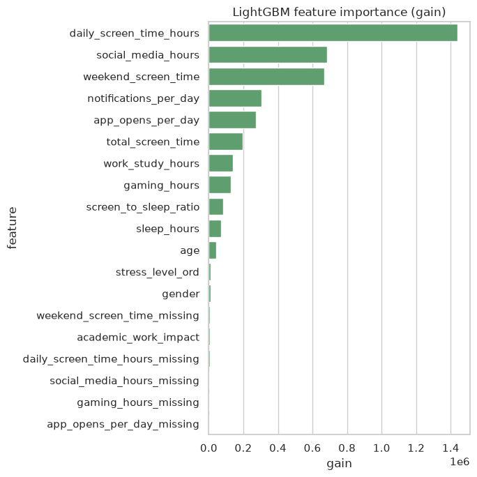</td>
</tr>
<tr>
<td width="33%" align="center">#1 Airline</td>
<td width="33%" align="center">#2 EV Purchases</td>
<td width="33%" align="center">#3 Smartphone Addiction</td>
</tr>
</table>

**ROC curve, confusion matrix, calibration (out-of-fold):**

<table>
<tr>
<td width="33%"></td>
<td width="33%"></td>
<td width="33%">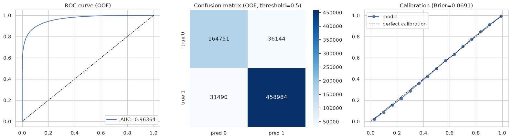</td>
</tr>
<tr>
<td width="33%" align="center">#1 Airline</td>
<td width="33%" align="center">#2 EV Purchases</td>
<td width="33%" align="center">#3 Smartphone Addiction</td>
</tr>
</table>

### Submission results


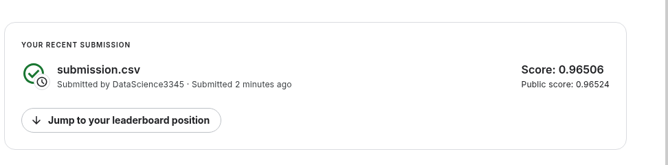

## #4: Digit Recognizer (MNIST) — a different kind of study

Unlike #1-3, this one is genuinely different in kind, not just in data: a CNN trained with
backprop on raw pixels, not gradient-boosted trees on tabular features, scored by categorization
accuracy rather than ROC AUC. It gets its own showcase rather than being forced into the
three-column comparison above, since there's nothing in #1-3 to compare it against.

- **Validation accuracy:** 0.98881 · **Leaderboard:** 0.98860 (public)
- CNN vs. a PCA(50)+logistic-regression baseline on the same split: 0.9888 vs. 0.9033 — the CNN's
  error rate is ~12% of the baseline's, which is the actual evidence the extra model complexity
  is earning its keep rather than being assumed.
- **Project folder:** [`04-digit-recognizer/`](04-digit-recognizer/)

<table>
<tr>
<td width="33%">

**Grad-CAM — what the CNN looks at**


</td>
<td width="33%">

**t-SNE of the learned representation**


</td>
<td width="33%">

**Robustness to noise and pixel shift**


</td>
</tr>
</table>

## #5: Facial Keypoints Detection — from regression to heatmaps

Predict 15 facial landmarks (30 coordinates) on 96×96 grayscale faces, scored by RMSE in pixels. Six models,
each tested against a measured baseline rather than assumed better. **Best: 1.61419 private / 1.94381 public**
(first model: 2.75978 / 2.95000) — a 41% lower private RMSE.

- **Project folder:** [`05-facial-keypoints-detection/`](05-facial-keypoints-detection/) — every attempt, figure and
  test in detail.

| # | Model | Held-out RMSE (px) | Kaggle private / public |
|---|---|---|---|
| v1 | CNN regressing 30 numbers directly, masked loss | 2.7384 | 2.75978 / 2.95000 |
| v2 | Integral regression (heatmap + soft-argmax), trained to convergence | 2.4385 | 2.46539 / 2.65896 |
| v3 | v2 refit on 100% of rows | *(no honest number)* | 2.62105 / 2.86097 — worse: its monitor rows were training rows |
| v4a | v2 + augmentation, σ=2 targets, learnable softmax temperature, flip test | 2.1980 | 2.24540 / 2.37053 |
| **v4b** | **v4a + Adaptive Wing Loss, 48×48 heatmap, CoordConv** | **1.7407** | **1.61419 / 1.94381** |
| ctrl | v2 again with another seed | 2.4601 | — (noise band: **0.022px**) |
| v4c | Deeper residual backbone + 2-stage refinement head | — | **future work**: not run (62 s/epoch at full resolution) |

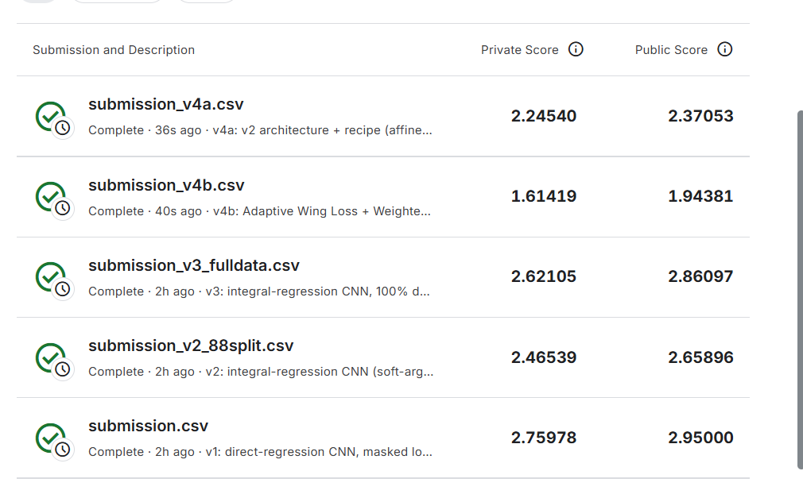

**Key mathematical results**

- *Integral regression* makes keypoints differentiable expectations over a heatmap:
  $\hat{\mathbf p}_k=\sum_{\mathbf u}\mathbf u\,\operatorname{softmax}(\beta H_k)(\mathbf u)$.
- *Centre-pull.* With targets in $[0,1]$ and $\beta=1$ the softmax is nearly flat, so the expectation is dragged toward
  the grid centre: ≈14px error on a **perfect** heatmap. σ=2 cells with β=12–15 cuts the decoder's own floor to
  0.02–0.03px. In trained models the slope of prediction on truth rises from **0.575 (v2) to 0.79 (v4)**.
- *Adaptive Wing Loss*
  $\mathrm{AWing}(y,\hat y)=\omega\ln(1+|(y-\hat y)/\varepsilon|^{\alpha-y})$ for $|y-\hat y|<\theta$, linear beyond — the
  exponent $\alpha-y$ makes it Wing-like on peaks (strong pull on small errors) and MSE-like on background, with a
  Weighted Loss Map $(W\!\cdot\!M+1)$ emphasising foreground and hard background.
- *Procrustes split* of each face's error: rigid (pose/scale) error falls from 0.38px (v2) to 0.09px (v4b); shape error
  from 1.51 to 1.21px.
- *Decoders on v4b:* soft-argmax 1.80 < DARK 1.94 < argmax + ¼ shift 2.05px — DARK beats the heuristic, but a network
  trained through soft-argmax is best read by it.

<table>
<tr><td width="50%"><b>Data: missingness is structured (MNAR)</b><br>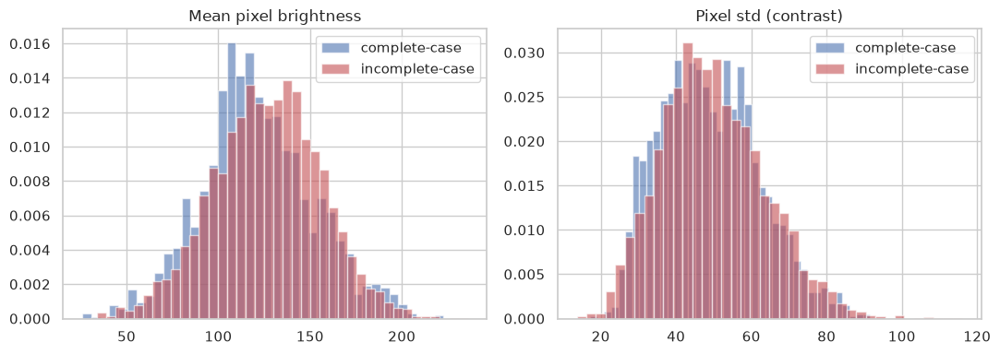</td>
<td width="50%"><b>Data: PCA shape model — mean face and top modes</b><br>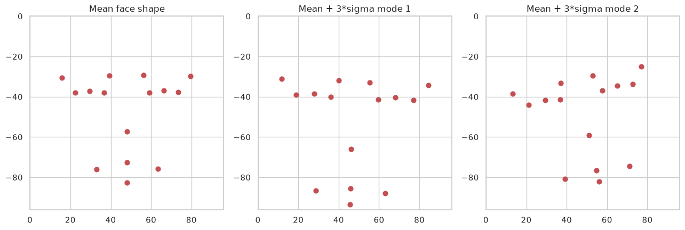</td></tr>
<tr><td colspan="2"><b>In-training statistics</b> (collected per epoch, drawn afterwards): held-out RMSE, loss split, LR, temperature β, gradient norm, centre-pull slope, softmax entropy and peak<br>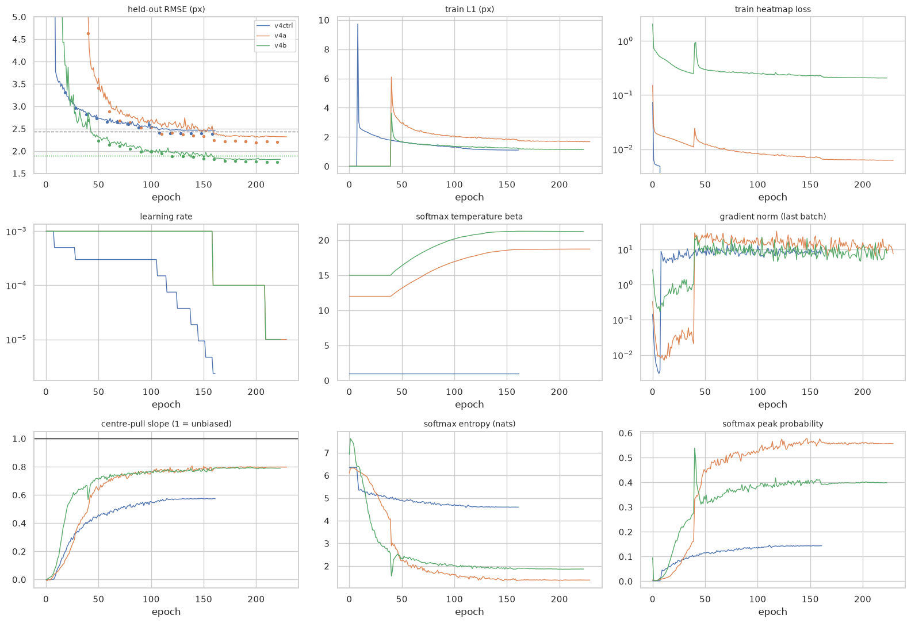</td></tr>
<tr><td width="50%"><b>Post-training: best held-out RMSE per model</b><br>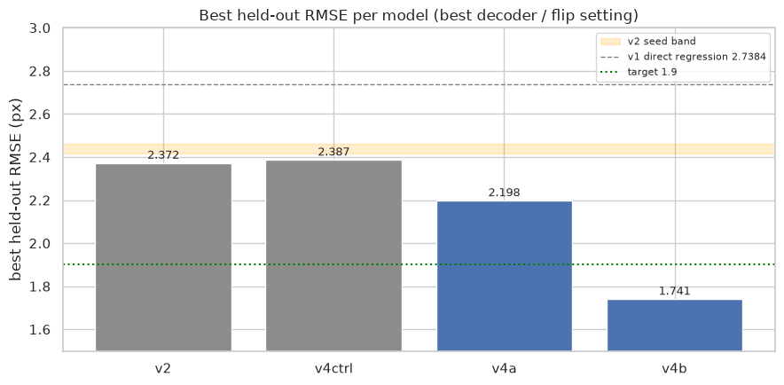</td>
<td width="50%"><b>Post-training: per-keypoint RMSE</b><br>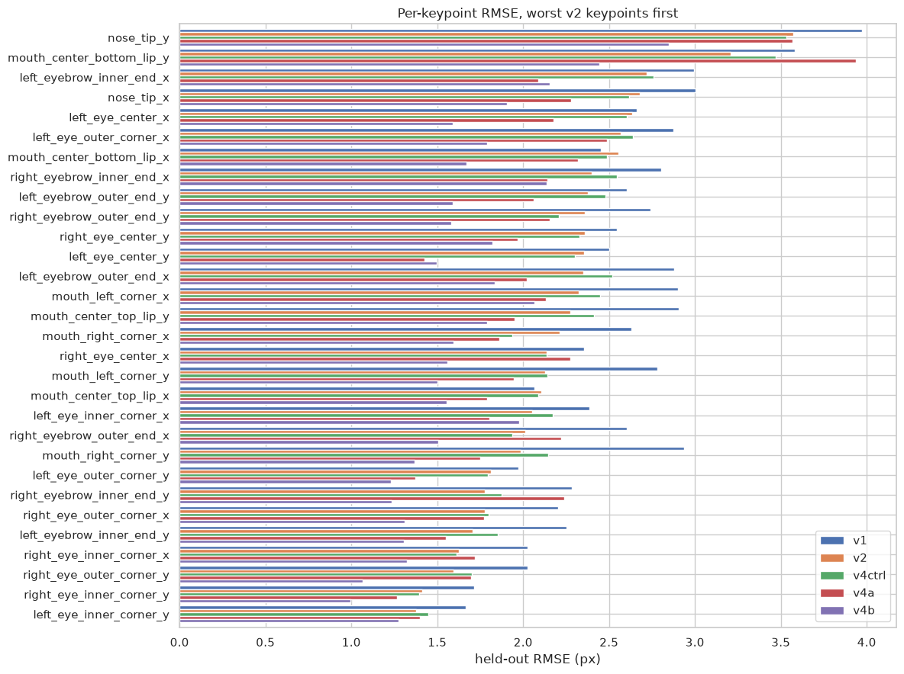</td></tr>
<tr><td width="50%"><b>Post-training: centre-pull slopes</b><br>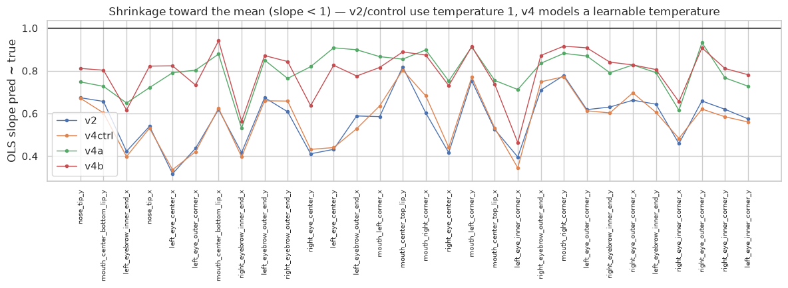</td>
<td width="50%"><b>Post-training: rigid vs shape error (Procrustes)</b><br>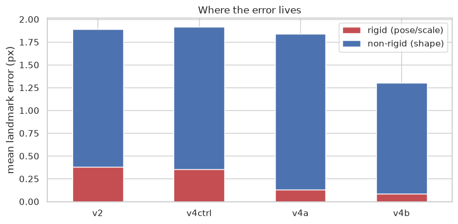</td></tr>
<tr><td width="50%"><b>Post-training: decoder ablation on v4b</b><br>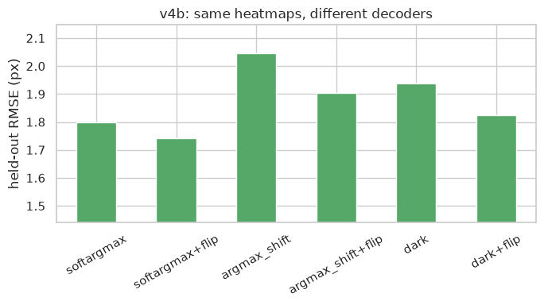</td>
<td width="50%"><b>Post-training: robustness to noise and shift</b><br>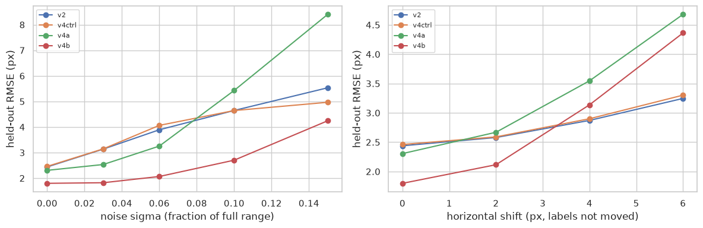</td></tr>
</table>

**Future work.** v4c tests whether capacity is the next bottleneck: a ResNet-18-style backbone without early
down-sampling plus a second stage that refines stage-1 heatmaps under intermediate supervision. It was too slow to
train alongside the other runs (62 s/epoch at full resolution) and is left for a dedicated run with a stride-2 stem,
then combined with v4b's loss.

## Mathematical foundations (#1-3)

**Metric — ROC AUC.** The probability that a randomly chosen positive example is ranked above a
randomly chosen negative one:

$$\mathrm{AUC} = P(\hat p_{+} > \hat p_{-}) = \int_0^1 \mathrm{TPR}(\mathrm{FPR}^{-1}(t))\,dt$$

equivalently the (normalized) Mann–Whitney U statistic over the model's scores. It is threshold-free
and invariant to monotonic rescaling of the predicted probability — which is why a well-ranked but
poorly calibrated model can still score well. Gini coefficient $= 2\,\mathrm{AUC} - 1$ relates it to
the more familiar Lorenz-curve measure.

**Gradient boosting.** LightGBM fits an additive ensemble

$$F_M(x) = \sum_{m=1}^{M} \eta\, h_m(x)$$

where each $h_m$ is a regression tree fit not to the raw labels, but to the functional gradient of
the loss at the current prediction. For binary log loss

$$L(y, p) = -\big(y \log p + (1-y)\log(1-p)\big), \qquad p = \sigma(F)$$

the per-sample gradient and Hessian are

$$g_i = p_i - y_i, \qquad h_i = p_i(1-p_i)$$

Each new tree is fit by a second-order (Newton) approximation of the loss, giving a closed-form
optimal leaf weight

$$w_j^{*} = -\frac{\sum_{i \in j} g_i}{\sum_{i \in j} h_i + \lambda}$$

and a closed-form split gain used to choose every split:

$$\mathrm{Gain} = \tfrac{1}{2}\left[\frac{G_L^2}{H_L+\lambda} + \frac{G_R^2}{H_R+\lambda} - \frac{G^2}{H+\lambda}\right] - \gamma$$

where $G, H$ are the summed gradient/Hessian over a node and $\lambda, \gamma$ are the L2 and
complexity penalties.

**Why LightGBM specifically.** Two choices make it fast at this row count: (1) **histogram-based
splitting** — continuous features are pre-binned into ≤255 buckets, turning an $O(n)$ sort-based
split search into an $O(\text{bins})$ scan per feature per node; (2) **leaf-wise (best-first) growth**
— at each step it grows the single leaf with the largest `Gain` rather than expanding every leaf at
the current depth, reaching a given loss reduction in fewer splits than level-wise growth (at the
cost of deeper, more overfit-prone trees — which is exactly why early stopping on a held-out fold
matters).

**Early stopping** is a variance-reduction device: boosting rounds are added until validation AUC
stops improving for 100 rounds. The learning-curve plot above verifies this directly — the
train/valid gap stays small and the stopping point lands well inside the round budget, not at its
edge.

**SHAP.** Feature attributions $\phi_i$ satisfy the efficiency property
$\sum_i \phi_i = f(x) - \mathbb{E}[f(x)]$ — Shapley values from cooperative game theory applied to
features-as-players. A brute-force computation is $O(2^{|\text{features}|})$; TreeSHAP computes the
exact same values in polynomial time by exploiting tree structure.

**Calibration.** The Brier score $\frac{1}{n}\sum_i (\hat p_i - y_i)^2$ measures whether predicted
probabilities are *quantitatively* trustworthy, not just well-ranked — a model can have excellent
AUC while being badly calibrated.

## Repository layout

```
kaggle-basics/
├── 01-predicting-airline-satisfaction/
│   ├── README.md                      # project write-up (same content as above, project-scoped)
│   ├── 01_airline_satisfaction.ipynb  # full executed notebook
│   ├── bench_threads.py               # LightGBM thread-scaling benchmark
│   ├── kaggle_kernel/                 # Kaggle-notebook-ready copy
│   ├── submission.csv                 # scored submission
│   ├── assets/                        # exported plots + leaderboard screenshot
│   └── results/PROVENANCE.md          # compute provenance for the training run
├── 02-predicting-ev-purchases/
│   ├── README.md
│   ├── 02_ev_purchases.ipynb
│   ├── kaggle_kernel_source.ipynb
│   ├── submission.csv
│   ├── assets/
│   └── results/PROVENANCE.md
├── 03-predicting-smartphone-addiction/
│   ├── README.md
│   ├── 03_smartphone_addiction.ipynb
│   ├── submission.csv
│   ├── assets/
│   └── results/PROVENANCE.md
├── 04-digit-recognizer/
│   ├── README.md
│   ├── 04_digit_recognizer.ipynb
│   ├── submission.csv
│   ├── assets/
│   └── results/PROVENANCE.md
└── 05-facial-keypoints-detection/
    ├── README.md                      # every attempt, math, in-/post-training figures
    ├── 01_v1_direct_regression.ipynb … 08_post_training_diagnostics.ipynb
    ├── fkd_v4_common.py, fkd_v4_configs.py   # GPU augmentation, models, losses, decoders, training loop
    ├── tests/                         # unit, mutation and smoke tests
    ├── submission.csv
    ├── assets/
    └── results/                       # per-epoch history, evaluation JSON, PROVENANCE.md
```

More competitions are added the same way — their own folder, notebook, diagnostics, and entry here.
